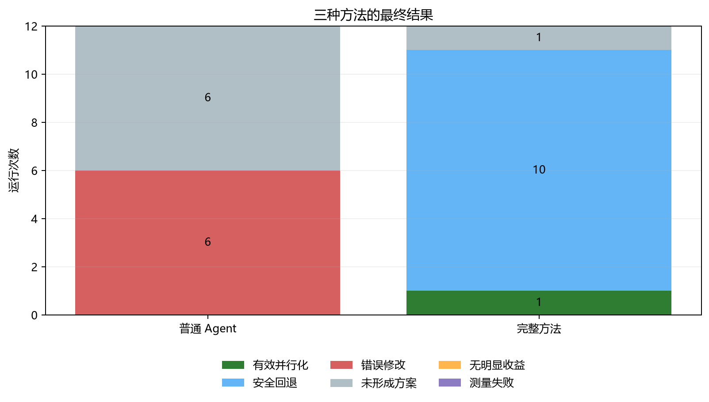

# Project-Level Parallelization Agent

本项目研究一个具体问题：通用代码 Agent 直接把真实的多文件 Python 项目并行化时，为什么
经常得到“有并行语法，但项目不能用或整体没有变快”的结果？

当前准备检验的观点是：真实项目中的并行单位不能只由循环结构决定，还取决于
**Worker 边界**——每个线程或进程到底接收什么数据、依赖什么状态、返回什么结果，以及
跨边界传输的代价。系统把这些实测证据提供给 Agent，再用原项目检查和前后夹测决定是否
保留修改。

当前代码版本：`v0.27.0-verified-boundary-delta`。

## 当前研究阶段

早期 Radon、Vulture、Chardet 和 MkDocs 实验用于发现问题，不作为新方法的主结果。人工
复核30个候选后，29个失败候选中有16个主要问题与 Worker 边界有关。M8据此在
scikit-learn #28064 和 #29330 上完成18次正式Agent实验，但边界证据组没有提高最终有效率：
6次结构失败、6次正确性失败、4次没有修改，另有1次表面加速但语义退化，最终只有普通
Agent在#28064上的1次补丁有效。

- B1：普通仓库级 Agent；
- B2：只告诉 Agent 修改位置；
- B3：再提供实测 Worker 边界证据。

M9进一步把问题收窄为“调用方和Worker必须成套变化的数据投影迁移”，提出Verified
Boundary Delta：Agent先声明关系变化，再由守卫工具原子执行，并保护调用者选择的并行后端。
M8结果见[正式汇总](docs/data/m8-formal-summary.json)，新方法和可否定假设见
[M9预注册](docs/m9-boundary-delta-hypothesis.md)。所有 `pilot-*` 只用于排查管线。

## 早期问题发现结果

主实验覆盖 Radon、Vulture、Chardet 和 MkDocs 四个真实开源项目，每种方法独立运行 12 次：

| 方法 | 有效并行 | 安全回退 | 错误修改 | 未形成方案 |
|---|---:|---:|---:|---:|
| B1 普通 Agent | 0 | 0 | 6 | 6 |
| B2 完整方法 | 1 | 10 | 0 | 1 |

完整方法在 Chardet 上有 1 次得到 3.251 倍端到端加速。其余大部分运行选择回退，说明当前
方法主要改善的是交付安全性，还不能稳定完成自动加速。详细结果见
[M6 真实项目实验发现](docs/m6-findings.md)。

实验编号统一为 B0 原始串行项目、B1 普通 Agent、B2 完整方法；MkDocs 的只加语义约束组记为
A1，Radon 的人工参考案例记为 B3。27 次正式 Agent 运行的原始证据哈希清单见
[`docs/data/research-evidence-manifest.json`](docs/data/research-evidence-manifest.json)。

Radon 的 Worker 边界实验原先建立在“人工参考版本有明显加速”这一前提上。固定协议复核发现，
人工版本虽然输出正确，但加速仅为 0.9986 倍，没有达到 1.05 倍门槛；旧的约 5.98 倍结论已撤回。
因此 M7 按研究前提失效终止，而不是继续用更多模型调用补齐一个已经无法回答原问题的实验。
详见 [Radon 人工参考复核](docs/reference-upper-bound.md)和
[M7 终止说明](docs/m7-worker-boundary-design.md)。



## 方法流程

```text
固定串行项目
  → 运行原测试、固定工作负载和串行计时
  → Agent 阅读入口、调用关系和状态
  → 生成任务边界与语义约束
  → 生成候选并行修改
  → 项目测试、固定输出和端到端性能检查
  → 合格则保留；不合格则修复，仍失败就恢复串行代码
```

有效并行化必须同时满足：原项目测试通过、固定输出一致、存在实际并行结构、端到端中位加速
至少 1.05 倍。只让某个内部函数变快不算成功。

## 从哪里开始阅读

- [方法说明](docs/method.md)：系统为什么这样设计；
- [实验设计与结果](docs/experiments.md)：项目、对照组、指标和真实数字；
- [相关工作](docs/related-work.md)：论文、研究空白与本项目的区别；
- [最终研究报告](docs/final-research-report.md)：从诊断、观点、方法到实验结论的完整整理；
- [当前局限](docs/limitations.md)：哪些结论现在还不能说；
- [Worker 边界实验](docs/m7-worker-boundary-design.md)：为什么该支线因实验前提失效而终止；
- [复现说明](docs/reproducibility.md)：环境与运行入口；
- [研究日志](docs/research-log.md)：问题发现、协议修正和方向变化。

## 环境

项目使用 Python 3.10～3.12。当前本机的 Conda 前缀环境解释器位于
`.venv\python.exe`；普通 `venv` 环境通常位于 `.venv\Scripts\python.exe`。在新的
Windows 环境中可使用 Conda：

```powershell
conda create -n parallel-agent python=3.12 -y
conda activate parallel-agent
python -m pip install -e ".[dev]"
```

DeepSeek Key 只保存在本机 `.env`，不进入 Git。

## 快速检查

不调用 DeepSeek，只检查项目代码：

```powershell
.\.venv\python.exe -m pytest -q
```

从零下载四个固定版本的真实项目、创建隔离环境并验证原测试与串行输出：

```powershell
.\.venv\python.exe scripts\bootstrap_candidate_projects.py `
  --workspace work\reproduction --input-environment
.\.venv\python.exe scripts\verify_candidate_reproduction.py `
  --workspace work\reproduction --output work\reproduction-audit.json
```

本次干净环境审计已通过，紧凑证据见
[`docs/data/candidate-reproduction-audit.json`](docs/data/candidate-reproduction-audit.json)。
详细说明见 [`docs/reproducibility.md`](docs/reproducibility.md)。

从本机原始实验重新生成紧凑结果和中文图表：

```powershell
.\.venv\python.exe scripts\summarize_m6_study.py
```

原始实验体积较大，默认只保存在本机 `results/`。Git 仓库保存汇总脚本、紧凑 JSON/CSV、
中文图表和研究文档。

## 主要目录

```text
configs/             四个真实项目的固定命令和上下文
src/parallel_agent/  仓库 Agent、验证与性能反馈实现
scripts/             实验、汇总和验收入口
tests/               本项目自动测试
docs/                方法、实验、相关工作、局限和研究日志
docs/data/           可提交的紧凑实验结果
docs/figures/        由紧凑结果生成的中文图表
results/             本机原始实验记录
work/                固定源码副本和隔离环境
```

## 研究边界

- 当前研究单机 CPU 并行，不声称完成真实多节点扩展；
- 主实验只有 4 个项目，每种方法 12 次运行；
- 安全回退不等于并行化成功；
- 现有测试和固定输出不能证明全部输入上的语义完全一致；
- 旧的单文件 Ray、任务融合和 DAG 调度代码只作为历史实验工具，不作为当前研究贡献。
