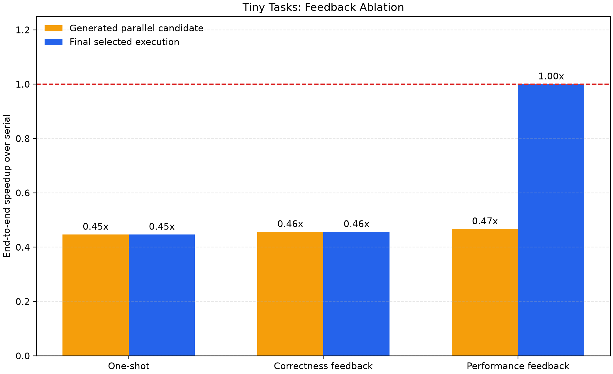
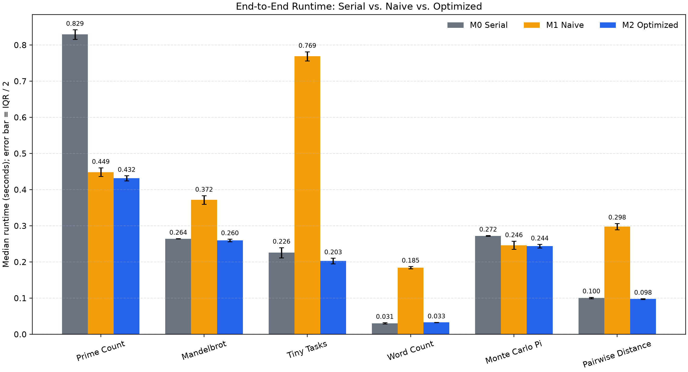
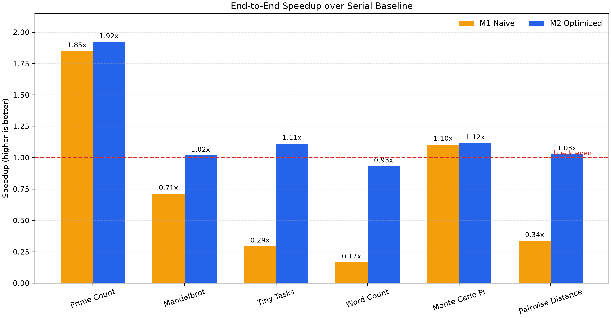

# 第一次项目进展汇报

汇报人：________  
导师：李钦宾老师  
建议汇报时间：2026-08-02  

## 1. 项目题目

**基于性能剖析与依赖分析的 Python 代码自动并行化 Agent**

英文暂定：

**Profile-Guided Agent for Dependency-Aware Python Parallelization**

## 2. 问题定义

本项目研究：

> 输入一段单机串行 Python 程序，由 Agent 分析依赖和性能特征，生成并行
> 执行方案与候选代码；系统自动验证正确性、测量运行效率，并根据运行反馈
> 调整 Worker、任务粒度或回退串行。

当前主动限制：

- 只处理 Python；
- 先支持单文件及显式 Map/Reduce 函数契约；
- 重点研究 CPU 数据并行；
- 当前本机使用 multiprocessing 验证方法，最终在兼容环境验证 Ray；
- 暂不承诺任意仓库、GPU 和复杂共享状态程序。

限制范围的原因是 ParEval-Repo 的结果表明，小程序翻译已经可行，但构建系统
与跨文件依赖会显著增加仓库级转换难度。

## 3. 核心研究问题

普通 LLM 很容易把循环改写成并行形式，但以下问题仍然存在：

1. 循环之间是否存在依赖？
2. 单个任务是否太小，导致调度开销超过计算收益？
3. Worker 和 Chunk 应该如何选择？
4. 输入输出序列化是否抵消加速？
5. 并行结果是否和串行结果一致？
6. 并行变慢时，系统能否主动拒绝或回退？

因此项目重点不是“成功生成并行语法”，而是：

> **降低盲目并行造成的性能退化，并给出可量化、可解释的决策。**

## 4. 当前系统路线

```text
串行 Python 程序
        ↓
AST 依赖与函数契约分析
        ↓
analysis.json
        ↓
Agent 生成 parallel_plan.json
        ↓
候选并行代码
        ↓
串行/并行分别执行
        ↓
正确性门控
        ↓
冷启动、热运行、CPU、任务数、序列化开销
        ↓
Worker/Chunk 搜索与收益 Gate
        ↓
接受优化 / 修复 / 回退串行
```

## 5. 已完成工作

### 工程

- Python 3.12 隔离环境；
- M0 串行、M1 朴素并行、M2 优化并行；
- AST 依赖分析；
- 冷启动与热运行分离；
- Worker 启动和空任务调度成本自动标定；
- 1/2/4 Worker 与多个 Chunk 候选搜索；
- 输入/输出序列化字节数和代理时间；
- 正确性验证与性能回退；
- 六类 Benchmark 的一键执行和 CSV 汇总；
- Agent 分析—规划—生成—执行—修复最小闭环；
- DeepSeek 在线结构化分析与规划适配器；
- Pro/Flash 分层路由与思考模式控制；
- 一次性、正确性反馈、性能反馈三种实验模式；
- 模型调用次数、Token 和响应记录；
- 28 项自动测试全部通过。

### Agent 产物

- `analysis.json`：函数、循环、依赖风险、并行判断与理由；
- `parallel_plan.json`：后端、策略、Worker、Chunk、正确性门控与回退；
- `candidate.py`：自动生成的候选程序；
- `run_report.json`：串行/并行结果、错误与修复记录。

首次真实 DeepSeek 验证覆盖三类程序：

- Prime Count：生成候选通过，串行与并行输出均为 `1767`；
- Prefix Sum：AST 检出跨迭代依赖，安全 Gate 拒绝并行；
- Tiny Tasks：候选结果正确，但小规模下并行端到端约 0.173 秒、串行约
  0.083 秒，说明后续必须加入性能反馈回退。

当前三个案例记录了 5 次模型调用、4,556 tokens，生成产物中未发现 API Key。
为控制成本，依赖与性能决策使用 V4 Pro，计划格式化使用关闭思考模式的
V4 Flash。一次路由冒烟测试中，Flash 计划阶段 completion tokens 从此前
代表调用的 884 降至 98；该对比输入不完全相同，目前只作为配置有效性证据。

### 性能反馈首轮消融

在 Tiny Tasks 上：

| 方法 | 候选正确 | 候选加速 | 最终选择 | 有效加速 |
|---|---:|---:|---|---:|
| 一次性生成 | 是 | 0.45x | 并行 | 0.45x |
| 正确性反馈 | 是 | 0.46x | 并行 | 0.46x |
| 性能反馈 | 是 | 0.47x | 串行回退 | 1.00x |

性能反馈组不会把回退包装成“额外加速”，而是说明系统避免了约两倍以上的
性能退化。作为正向对照，相同协议在 Prime Count Large 上测得约 1.78 倍
端到端加速，并保留 4 Worker / 4 Chunk 并行方案。



## 6. 初步实验

以下为 Large 规模正式本机基线。每种方法预热 1 次、正式运行 5 次，并用
固定种子随机打乱执行顺序。表中为端到端时间中位数，括号内为 IQR。

| Benchmark | M0 Serial | M1 Naive | M2 | M2 决策 |
|---|---:|---:|---:|---|
| Prime Count | 0.829 (0.026) s | 0.449 (0.024) s | 0.432 (0.014) s | 4 Worker / 4 Task |
| Mandelbrot | 0.264 (0.001) s | 0.372 (0.024) s | 0.260 (0.007) s | 回退串行 |
| Tiny Tasks | 0.226 (0.028) s | 0.769 (0.026) s | 0.203 (0.015) s | 回退串行 |
| Word Count | 0.031 (0.003) s | 0.185 (0.006) s | 0.033 (0.001) s | 回退串行 |
| Monte Carlo | 0.272 (0.002) s | 0.246 (0.023) s | 0.244 (0.010) s | 4 Worker / 4 Task |
| Pairwise Distance | 0.100 (0.004) s | 0.298 (0.017) s | 0.098 (0.002) s | 回退串行 |

观察：

- Prime Count 和 Monte Carlo 的计算/通信比较高，M2保留并行，端到端中位
  加速分别约为 1.92 倍和 1.12 倍；
- Tiny Tasks 创建 2000 个 Task 后明显变慢，M2回退串行；
- Word Count 输入序列化约 2.75 MB，但串行任务本身过短；
- Pairwise Distance 输入序列化约 3.48 MB，当前规模下并行无收益；
- M2不是保证每次获得最高瞬时速度，而是降低严重性能退化。





## 7. 开销标定示例

在一次本机标定中：

| Worker 数 | 启动时间 | 空任务平均调度开销 |
|---:|---:|---:|
| 1 | 0.126 s | 0.132 ms |
| 2 | 0.151 s | 0.131 ms |
| 4 | 0.168 s | 0.120 ms |

在五次重复正式基线中，以 Prime Count 为例：

- 串行中位数：约 0.829 秒；
- M2 热运行中位数：约 0.261 秒；
- Worker 冷启动中位数：约 0.178 秒；
- M2 端到端中位数：约 0.432 秒；
- 热运行加速约 3.18 倍；
- 端到端加速约 1.92 倍。

这说明短任务必须区分热运行与端到端时间，否则容易高估并行收益。

## 8. 已发现的失败与边界

1. Prefix Sum 存在跨迭代依赖，系统拒绝朴素并行；
2. 细粒度任务的调度开销可能远大于计算收益；
3. 大数组或文本输入存在明显序列化成本；
4. 当前 Windows 中文主机名会触发 Ray 2.56.1 运行时错误；
5. 首次真实模型响应曾返回空 `rationale`，说明合法 JSON 仍需 Schema 与
   确定性安全门控；修复后已加入回归测试；
6. 初版静态分析曾把任务内部局部累加误认为任务间依赖，现已按显式
   `unit(item)` 边界修复；
7. 当前在线 Agent 只有三个代表案例，尚不能报告模型平均成功率。

## 9. 相关工作依据

- ParEval（HPDC 2024）：并行代码生成必须同时评价正确性与性能；
- PerfCodeGen（2024）：利用实际运行时间反馈迭代优化代码；
- OpenCodeInterpreter（ACL 2024）：代码生成、执行和修复闭环；
- Ray（OSDI 2018）：统一 Task/Actor 抽象和分布式执行；
- ParEval-Repo（ICPP 2025）：仓库级跨文件转换难度显著上升；
- ParaCoder（FCPC 2025）：使用规划和工具构建并行代码生成 Agent。

详细链接见项目内 `docs/literature-notes.md`。

## 10. 下一阶段计划

1. 把三组消融扩展到 4 个代表任务并进行多次独立模型运行；
2. 加入每组 API 成本与摊销次数；
3. 扩充到 8～10 个 Benchmark；
4. 为 Agent 组进行多次独立运行并记录调用数、Token 和修复轮次；
5. 加入 Worker/Chunk 消融；
6. 条件允许时在 Linux/Ray 环境复现；
7. 完成最终报告、PPT 和 Demo。

## 11. 希望导师确认的问题

1. 当前将范围限制为 Python 单文件、数据并行和显式函数契约，是否合理？
2. 项目应优先深入任务粒度与收益 Gate，还是增加 DAG 关键路径调度？
3. 单机多进程可否作为主要方法验证，最终补一组 Ray/Linux 实验？
4. 课题组是否能提供 Linux 机器或已有 Ray/Maze 环境？
5. 最终考核更看重系统实现、量化实验，还是论文式报告？
6. 是否需要加入人工编写并行代码作为性能上界？
