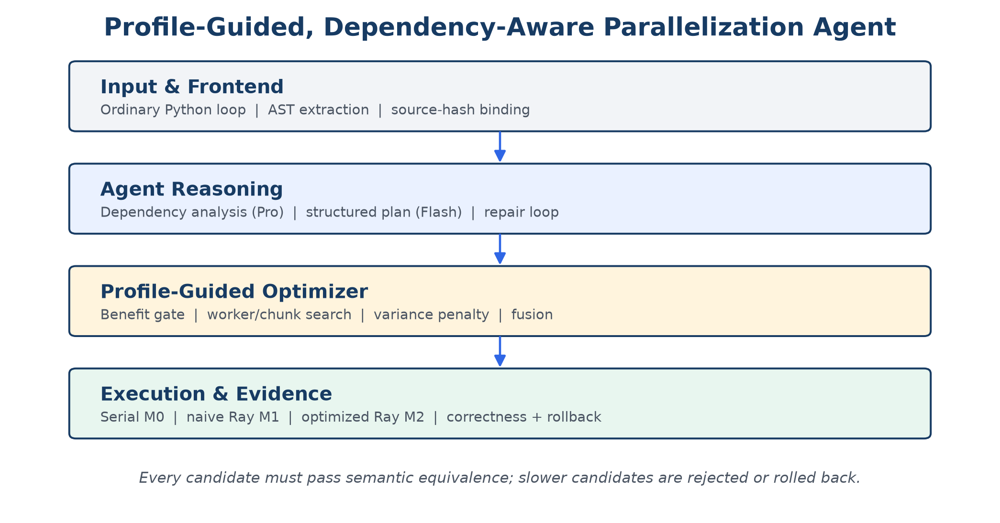
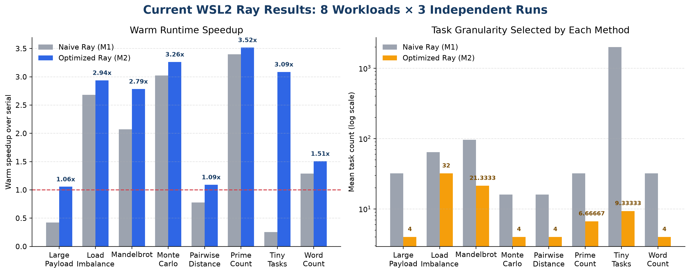
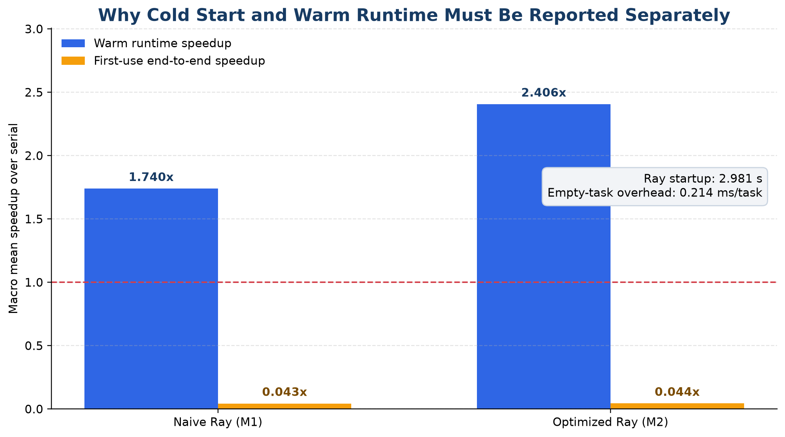
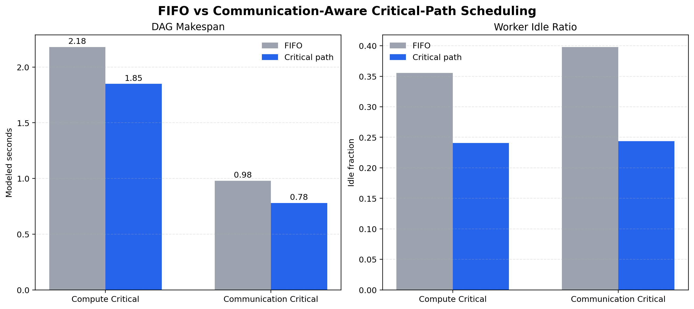

# 基于性能剖析与依赖分析的 Python 代码自动并行化 Agent

**科研项目完整汇报（阶段成果）**

项目类型：本科生科研探究项目  
指导教师：李钦宾老师  
技术版本：v0.23.2-node24-ci  
报告日期：2026 年 7 月 30 日

> 核心结论：大模型把循环改写成 Ray 任务并不困难，真正决定项目质量的是能否回答“是否值得并行、如何划分任务、怎样控制通信与调度开销、结果是否可信”。本项目因此将重点从“生成并行代码”转向“以真实执行证据驱动并行决策”。

[PAGEBREAK]

## 摘要

大模型已经能够生成语法正确的并行代码，但代码“能够运行”并不等于“运行得更快”。针对朴素自动并行化容易忽略循环依赖、任务粒度、负载不均衡、序列化成本和运行环境的问题，本项目实现了一套面向 Python 数据并行程序的性能剖析驱动 Agent。系统以普通 Python 循环或规范化工作负载为输入，先结合 AST 静态分析与大模型语义判断形成结构化并行计划，再通过真实执行获得计算成本、Ray 调度成本和数据传输代理指标，自动搜索 Worker 数量与 Chunk 数量，并用正确性门控和性能回退机制决定是否采用候选代码。

实验设置包含原始串行代码 M0、朴素 Ray 并行代码 M1 和优化 Ray 并行代码 M2 三组。当前主实验在 WSL2 的真实 Ray 后端上覆盖 8 类工作负载、3 次独立实验、每种模式 5 次计时，共形成 360 个正式计时样本，全部通过正确性验证。结果显示：M1 的宏平均热运行加速比为 1.740×，性能退化率为 37.5%；M2 的宏平均热运行加速比达到 2.406×，性能退化率降为 0%，并在 91.7% 的“工作负载—实验轮次”组合上优于串行。M2 相对 M1 的几何平均运行时提升为 1.734×，在 87.5% 的工作负载上胜出。与此同时，Ray 初始化平均耗时 2.981 秒，使首次使用端到端加速比只有约 0.044×，说明短任务或低复用场景不应盲目采用分布式执行。

项目还完成了配置搜索消融、通信感知任务融合、关键路径调度模型、DeepSeek 受控代码生成以及普通循环前端的端到端验证。更重要的是，研究过程中保留并分析了多次失败：小任务拆分过细、连续分块导致长尾、冷启动掩盖热运行收益、Windows 环境不稳定、Agent 失去原始语义上下文，以及“连接集群”不等于“跨节点执行”。这些问题推动系统逐步形成依赖安全门、方差惩罚、哈希绑定、统一证据链和可复现发布流程。

**关键词：** 大模型 Agent；自动并行化；Ray；性能剖析；任务粒度；依赖分析；通信开销；可复现性

## 1. 研究背景与问题提出

Python 代码在科研计算、数据处理和原型开发中使用广泛，但大量程序仍以串行循环形式执行。人工并行化要求开发者同时理解数据依赖、进程通信、调度策略和性能分析，对初学者门槛较高。大模型擅长程序理解和代码生成，因此可以作为“并行化助手”，把串行代码转换为 Ray 等分布式框架能够执行的代码。

然而，本项目开始后很快发现，若只要求模型“把 for 循环改成 Ray”，很容易得到表面正确、实际低效的结果。问题主要来自四个方面：

- **语义安全：** 循环是否存在跨迭代依赖、共享状态或副作用；
- **任务粒度：** 每个任务太小会被调度开销淹没，太大又会失去并行性；
- **负载与通信：** 相同数量的输入不代表相同计算量，中间数据传输也可能超过计算收益；
- **评价口径：** 冷启动、热运行和首次使用端到端时间代表不同使用场景，不能混为一个“加速比”。

因此，本项目的研究问题被重新定义为：

> 能否构建一个依赖感知、性能剖析驱动的 Agent，使其不仅生成并行代码，还能够根据真实运行证据判断是否并行、选择任务粒度、控制通信开销，并在性能下降时自动回退？

## 2. 相关工作与研究定位

ParEval 与 ParEval-Repo 表明，评价大模型生成并行代码时，必须同时考虑正确性、可执行性与性能；跨文件依赖和仓库级变换会显著增加难度。因此，本项目把支持范围限制在单文件或少量函数、以数据并行为主的 Python 程序，而不声称解决任意大型代码库的自动转换问题。

PerfCodeGen 的重要启发是把真实运行时间反馈给模型，使优化建立在可测量证据上，而不是仅依赖语言模型的主观判断。OpenCodeInterpreter 说明执行反馈能够改善代码生成的可靠性。Ray 提供远程任务、对象存储和动态调度，使同一套代码可以先在单机多核环境验证，再扩展到多节点。HEFT 等任务图调度工作则提示：调度不仅要看单个任务耗时，还应考虑关键路径和任务间通信。

基于这些工作，本项目不训练新的大模型，也不修改 Ray 内部调度器，而是在模型与执行后端之间增加一层可解释的优化与验证控制：

1. 静态分析负责发现显式依赖与危险操作；
2. 大模型负责补充语义理解并生成结构化计划；
3. 性能剖析负责提供真实成本；
4. 优化器负责选择 Worker、Chunk、融合和调度方案；
5. 执行器负责正确性门控、性能比较和自动回退。

## 3. 研究目标、边界与贡献

### 3.1 研究目标

本项目设定三个逐层递进的目标：

1. **可运行：** 自动生成 Ray 候选代码并捕获异常；
2. **可信：** 与串行黄金结果比较，错误候选不得进入性能评价；
3. **高效：** 用实测数据优化任务划分，并拒绝或回退低收益方案。

### 3.2 支持边界

| 支持范围 | 当前不支持 |
|---|---|
| Python 单文件或少量多函数程序 | 任意大型 GitHub 仓库 |
| 独立 Map、Map-Reduce、简单 DAG | 强共享状态、复杂锁与事务 |
| CPU 密集型数据并行 | GPU 内核自动生成 |
| Ray Task 与单机/集群连接 | 修改 Ray 底层调度器 |
| 普通循环前端的受控转换 | 对任意 Python 动态语义作完整静态证明 |

明确边界并不是降低目标，而是保证研究结论与证据匹配。当前系统能够证明“在所覆盖的数据并行和简单任务图场景中有效”，不能据此推断“任意 Python 程序都可以自动高效并行化”。

### 3.3 当前贡献

- 构建了从普通循环、结构化分析、Agent 规划、Ray 代码生成到执行验证的完整闭环；
- 提出并实现依赖安全门、收益 Gate、Worker/Chunk 搜索、负载方差惩罚和性能回退；
- 建立 M0/M1/M2 三组统一对照和冷启动/热运行分离的评价协议；
- 在真实 WSL2 Ray 后端完成 8 个工作负载、360 个正式计时样本；
- 用反例证明系统能够识别“不值得并行”或“不宜采用固定策略”的情况；
- 建立数据、日志、生成代码、版本标签、自动测试和 CI 共同组成的复现证据链。

## 4. 系统总体设计

系统以“分析—计划—生成—执行—验证—优化—回退”为主线。静态分析和 Agent 不直接决定最终结果，它们只产生候选；真正的裁决依据来自串行黄金输出和实测性能。

### 4.1 三组方法定义

| 方法 | 定义 | 作用 |
|---|---|---|
| M0 串行基线 | 原始 Python 实现 | 正确性黄金结果与时间基准 |
| M1 朴素并行 | 固定 Worker、固定/逐项任务划分，不做收益判断 | 代表“让 Agent 直接改成 Ray”的简单方案 |
| M2 优化并行 | 依赖门控、动态剖析、粒度搜索、方差惩罚、融合与回退 | 本项目完整方法 |

### 4.2 Agent 模型路由

考虑成本与任务难度，系统将 DeepSeek 模型按职责路由：

- **Pro 模式：** 用于依赖关系、共享状态、失败原因和高风险代码判断；
- **Flash 模式：** 用于结构化计划整理、常规检查、文档摘要和低风险转换；
- **模板路径：** 对已经被静态证明的简单模式直接生成，作为低成本稳定基线。

这种设计的目的不是追求“多 Agent 数量”，而是把有限 Token 用在真正需要语义推理的节点上。

## 5. 核心方法

### 5.1 AST 依赖分析与危险模式识别

系统使用 Python `ast` 提取循环变量、读写集合、函数调用、全局状态和容器修改。重点识别以下模式：

| 模式 | 例子 | 决策 |
|---|---|---|
| 独立任务 | `result[i] = f(data[i])` | 可进入数据并行候选 |
| 归约 | `total += f(x)` | 分块计算后合并 |
| 循环携带依赖 | `a[i] = a[i-1] + x[i]` | 拒绝朴素并行 |
| 共享副作用 | 多任务写同一字典或文件 | 拒绝或先重构 |

AST 只负责能明确证明的结构事实，大模型用于解释函数语义，最后由执行测试验证。三者相互制约，避免完全相信任一单独来源。

### 5.2 动态性能剖析

系统记录墙钟时间、任务数量、样本任务耗时、Ray 初始化时间、空任务调度成本、输入输出序列化字节数和 CPU 使用情况。一个候选是否值得并行，取决于计算收益能否覆盖初始化、调度、序列化和合并开销。

对输入规模 n、Chunk 大小 c、Worker 数量 p，使用下式作初步估计：

$$T̂(c,p) = T_init + ⌈(n/c)/p⌉ · (cC + H + D(c)) + T_merge$$

其中 C 是单个数据项计算成本，H 是单任务固定调度成本，D(c) 是 Chunk 的数据传输代理成本。该模型不是精确预测器，而是拒绝明显不合理方案的安全门；最终仍以真实运行中位数为准。

### 5.3 收益 Gate

当预测最优并行时间没有比串行时间至少降低 5%，或样本任务粒度明显小于调度成本阈值时，系统不强制并行。候选代码只有同时满足以下条件才会被保留：

1. 输出与串行黄金结果等价；
2. 多次运行中位数不比串行显著退化；
3. 记录的收益来自所声明口径，例如热运行或首次端到端时间。

### 5.4 Worker 与 Chunk 自适应搜索

优化器采用两阶段搜索控制成本：

1. 测试多个 Worker 数量，选出较优并行度；
2. 固定 Worker 后，搜索每个 Worker 对应的 Chunk 数量。

设一次任务固定开销为 H，希望开销不超过任务总时间的 5%，则任务计算时间至少应约为 20H。以单项计算成本 C 估计初始 Chunk：

$$c₀ = ⌈20H/C⌉$$

再在 c₀/2、c₀、2c₀、4c₀ 附近验证。这样可以把模型的角色从“猜一个数字”变成“提出候选，由数据选择”。

### 5.5 负载方差与长尾惩罚

初版只使用平均任务耗时，无法识别计算量高度不均匀的输入。改进后，系统对样本成本分布计算变异系数，并估计尾部任务造成的 Straggler 风险。当方差较大时，优化器倾向于增加 Chunk 数，让调度器有机会把重任务分散到不同 Worker，而不是机械地使用“每个 Worker 一个大块”。

### 5.6 通信感知任务融合

对线性任务链 v→u，若中间结果只被一个后继使用、序列化成本相对计算成本较高，系统尝试将两个阶段融合到同一 Worker 内执行。若中间结果存在多个消费者，固定融合会破坏并行性，因此系统保留原图。融合决策不是“一律合并”，而是用消费者数量和通信/计算比共同判断。

### 5.7 DAG 关键路径调度

对简单任务图，系统实现 FIFO 与关键路径优先两种策略。任务排序使用简化的向上 Rank：

$$rank(v) = t_v + max_{u∈succ(v)}(c_{v,u} + rank(u))$$

其中 t_v 为任务时间，c_(v,u) 为通信代价。当前该模块的证据来自确定性的同构调度模型，用于验证策略方向，不被表述为真实 Ray 加速。

### 5.8 正确性门控、修复与回退

整数和结构化对象采用严格比较，浮点数组使用容差比较。出现语法错误、超时、异常或结果不一致时，Agent 最多进行受控修复，并保留每一轮代码与日志。优化代码若正确但更慢，则自动回退到串行或更快的并行候选。失败不会被从统计中删除。

## 6. 工程实现与复现环境

项目采用 Python 包结构，主要模块包括：

- `analyzer`：AST、循环依赖和危险模式；
- `profiler`：运行时间、序列化和 Ray 开销测量；
- `agent_pipeline`：DeepSeek 分析、计划、生成和修复；
- `optimizer`：收益 Gate、Worker/Chunk 搜索、方差惩罚；
- `task_fusion` 与 `dag_scheduler`：通信感知融合和任务图调度；
- `runner` 与 `suite`：M0/M1/M2 统一执行；
- `verify_project.py`：测试、文档、正式数据和发布状态的一键验证。

主性能实验在 Windows 主机的 WSL2 环境中运行真实 Ray。为了避免每个 Ray Worker 内部的 NumPy/BLAS 再次开启多线程，实验固定相关线程数为 1。项目当前有 78 项自动测试通过，并由 GitHub Actions 在 Node 24 兼容动作上执行统一验证。

## 7. 实验设计

### 7.1 工作负载

| 类别 | 工作负载 | 主要考察问题 |
|---|---|---|
| 计算密集 | Prime Count、Mandelbrot、Monte Carlo | 基本数据并行与加速上限 |
| 归约/矩阵 | Word Count、Pairwise Distance | 合并成本与 Chunk 选择 |
| 边界场景 | Tiny Tasks、Large Payload | 调度开销与序列化开销 |
| 负载不均衡 | Load Imbalance | 长尾与动态粒度 |
| 任务图 | Fusion Chain、Fusion Fanout、Synthetic DAG | 融合与关键路径 |
| 反例 | Prefix Sum | 循环携带依赖，应拒绝朴素并行 |

### 7.2 主实验协议

- 8 个 Ray 工作负载；
- 3 次独立实验；
- M0、M1、M2 三种模式；
- 每种模式 1 次预热、5 次正式计时；
- 共 8×3×3×5＝360 个正式计时样本；
- 固定随机种子，保存原始 JSON/CSV、环境、任务数和正确性结果；
- 报告中位数/聚合统计，失败样本保留。

### 7.3 评价指标

加速比、并行效率和总开销定义为：

$$S_p = T_serial/T_p，E_p = S_p/p，O_p = pT_p − T_serial$$

性能退化率定义为并行时间超过串行 5% 的测试比例。对 Agent 的离线成本，还计算收支平衡执行次数：

$$N_break-even = ⌈T_agent/(T_serial − T_opt)⌉$$

此外记录正确率、可运行率、修复轮数、Token 数、任务数量、序列化字节数、Ray 初始化时间与空任务开销。

## 8. 实验结果

### 8.1 WSL2 真实 Ray 主结果

| 指标 | M1 朴素 Ray | M2 优化 Ray |
|---|---:|---:|
| 宏平均热运行加速比 | 1.740× | **2.406×** |
| 性能退化率 | 37.5% | **0%** |
| 优于串行的运行组合 | 62.5% | **91.7%** |
| 首次使用端到端加速比 | 0.043× | 0.044× |
| 正确性 | 100% | 100% |

M2 相对 M1 的几何平均运行时提升为 1.734×，在 8 个工作负载中的 7 个胜出。最明显的案例是 Tiny Tasks：M1 把 2000 个数据项拆成 2000 个 Ray 任务，热运行只有 0.255×；M2 将其批处理为平均 9.33 个任务，提升到 3.087×。Large Payload 和 Pairwise Distance 的 M1 也低于串行，M2 通过减少任务数量和传输次数分别提高到 1.056× 和 1.092×，虽然收益有限，但避免了明显退化。

对于 Prime Count、Monte Carlo 和 Mandelbrot 等计算密集任务，M1 已经能获得加速，M2 通过更合理的 Worker/Chunk 配置进一步提高到 3.518×、3.264× 和 2.785×。这说明优化器并非只会“拒绝并行”，也能在可并行任务上寻找更好的实现。

### 8.2 冷启动与热运行

Ray 初始化平均耗时 2.981 秒，空任务固定开销约为 0.214 毫秒/任务。若把初始化计入短任务的一次性运行，M1 与 M2 都明显慢于串行。因此，本项目不使用单一“总加速比”掩盖场景差异，而是同时报告：

- **Warm Runtime：** Ray 已启动，适用于服务化、批处理和反复执行；
- **First-use End-to-end：** 从初始化开始的一次执行，适用于一次性脚本；
- **Break-even：** Agent 与初始化成本需要重复运行多少次才能收回。

当前实验的收支平衡次数中位数为 34.5 次，均值受两个无热运行节省案例影响达到 379.95 次。结论是：项目展示了“在重复计算场景中如何加速”，而不是宣称“所有一次性脚本都适合 Ray”。

### 8.3 配置搜索消融

在历史本地多进程消融中，固定配置宏平均加速比为 0.926×，退化率为 70.8%；完整配置搜索达到 1.149×，退化率为 0%。这组实验与主 Ray 实验后端不同，因此只用于说明“配置搜索和收益 Gate 的方向有效”，不与 Ray 数值直接合并。

### 8.4 通信感知任务融合

对单消费者线性链，感知融合把任务数从 16 降为 8，并消除 8,388,896 字节的中间传输代理量，获得 22.02× 加速。对于一个中间结果被多个后继使用的扇出图，固定融合只有 0.545×；感知策略识别反例并保留未融合结构，达到 1.119×。该实验说明，任务融合的关键不是“能不能合并函数”，而是“合并是否破坏并行性或重复计算”。

### 8.5 DAG 调度模型

在计算关键型和通信关键型两个合成图上，关键路径策略相对 FIFO 的建模加速比分别为 1.178× 和 1.256×，Worker 空闲比例也明显下降。这里的数值是确定性调度模型的 Makespan，不是 Ray 实测时间。该模块证明了策略的可实现性，但仍需要真实多节点环境进一步验证。

### 8.6 DeepSeek 受控代码生成

4 个工作负载、3 次独立生成形成 12 对样本。模板路径 12/12 正确，受控 LLM 路径 11/12 正确，即 91.7%；唯一未修复失败被保留在结果中。LLM 生成与修复共调用 20 次、使用 16,978 Token、发生 8 次修复。成功样本的宏平均运行时比例约为模板的 1.021 倍，没有实质性能优势。

这一结果帮助明确了 Agent 的定位：大模型更适合分析语义、处理普通代码形态和解释失败；性能决策仍应由结构化优化器与实测数据控制。

### 8.7 普通循环前端端到端案例

系统已完成“普通 Python 循环 → AST 规范化 → DeepSeek 分析/计划 → Ray 候选 → 正确性验证”的真实流程。该案例使用 2 次模型调用、2,435 Token，串行与 Ray 输出均为 3491，任务数为 2。

但候选在隔离子进程中每次重新初始化 Ray，串行总时间中位数为 0.514 秒，并行总时间为 6.316 秒。这不是一个应被隐藏的失败，而是说明“转换正确”和“执行高效”是两个独立目标。普通循环前端目前证明了功能闭环；性能结论来自统一、预热后的 Ray Runner。

## 9. 研究过程、遇到的问题与本科生思考

这一节不是按代码提交顺序罗列功能，而是记录我在研究中如何从直觉出发、被实验推翻，再逐步形成可验证方法。作为第一次接触分布式并行和开放科研任务的本科生，我最大的变化是：不再把“代码跑通”当作结论，而是先问证据能支持多强的说法。

### 9.1 问题一：我最初以为任务越多，并行性越强

**最初判断。** 刚开始接触 Ray 时，我很自然地认为，把每个数据项都提交成一个远程任务，可以最大限度利用 CPU。

**实验异常。** Tiny Tasks 的 M1 生成了 2000 个任务，热运行加速比只有 0.255×，比串行慢约 4 倍。代码是正确的，但“并行版本”反而明显退化。

**提出假设。** 我怀疑不是计算本身慢，而是任务提交、调度和序列化的固定成本超过了每个小任务的计算量。

**验证与修正。** 我单独测量空 Ray 任务，得到约 0.214 毫秒/任务的固定开销；随后把任务计算时间目标设为固定开销的约 20 倍，并搜索附近的 Chunk。M2 最终只提交平均 9.33 个任务，加速比提高到 3.087×。

**形成认识。** 并行度不是越高越好。真正需要优化的是“有用计算 / 调度开销”的比例。以后看到循环时，我首先问的不是“怎样拆”，而是“每块工作是否足够大”。

### 9.2 问题二：平均任务耗时无法解释负载不均衡

**最初判断。** 初版优化器使用样本平均耗时估计 Chunk 大小，并倾向于每个 Worker 分配一个连续大块。

**实验异常。** 在 Load Imbalance 上，某次旧版 M2 只有约 1.086×，反而弱于朴素方案约 2.703×。从平均耗时看配置合理，但总完成时间被少数慢任务拖住。

**提出假设。** 输入的计算成本随位置变化，连续切块把重任务集中到了同一 Worker。平均值掩盖了分布形状和尾部。

**验证与修正。** 我增加分层采样、变异系数和 Straggler 惩罚。当成本方差较高时，系统使用更多 Chunk，让 Ray 动态分配重任务。当前正式结果中，M2 平均选择 32 个任务，热运行加速比达到 2.938×，高于 M1 的 2.680×。

**形成认识。** 性能模型不能只看均值。分布式程序的总时间由最慢 Worker 决定，因此“尾部有多重”往往比“平均有多快”更重要。

### 9.3 问题三：热运行很快，但第一次运行为什么极慢

**最初判断。** 当我看到 M2 在多个任务上超过 2× 时，一度认为可以直接得出“并行代码更快”的结论。

**实验异常。** 普通循环端到端案例中，并行总时间 6.316 秒，远慢于串行 0.514 秒。主实验若计入初始化，宏平均首次使用加速也只有约 0.044×。

**提出假设。** Ray 启动和 Worker 建立是一次性固定成本，短程序只有一次执行时无法摊销。

**验证与修正。** 我将计时拆成启动、预热后计算和首次端到端三部分，实测启动平均 2.981 秒，并增加 Break-even 次数。最终报告不再使用一个含义模糊的“加速比”。

**形成认识。** “快不快”必须绑定使用场景。同一段代码在长期服务中可能有效，在一次性脚本中却不值得并行。量化分析首先要定义口径。

### 9.4 问题四：Windows 上能安装 Ray，不代表实验环境稳定

**最初判断。** 我希望直接在 Windows 环境完成开发和实验，减少配置成本。

**实验异常。** 中文主机名相关行为和 Ray/CI 的 Unix Socket 路径长度导致不稳定；有些本地测试能过，但在自动验证环境中失败。

**提出假设。** 问题不是业务代码，而是分布式运行时对进程、路径和系统接口的假设不同。

**验证与修正。** 主实验迁移到 WSL2，Ray 临时目录改为短路径 `/tmp/pa_ray`；CI 增加真实 Ray Smoke，并把验证工作流升级到 Node 24 兼容动作。当前 78 项测试和发布检查统一通过。

**形成认识。** 环境不是科研代码之外的“杂事”。对分布式系统而言，进程模型、文件路径和运行时版本都是方法成立的条件，必须写进复现说明。

### 9.5 问题五：Agent 第一次拒绝转换，因为它看不到原始语义

**最初判断。** 我以为 AST 前端把循环规范化成统一包装器后，模型只看规范化代码就足够完成安全判断。

**实验异常。** DeepSeek 第一次拒绝并行化，因为包装器隐藏了原始 `unit` 函数，模型无法确认它是否纯函数、是否修改共享状态。

**提出假设。** 前端转换虽然方便工程实现，却丢失了 Agent 作语义判断所需的上下文。如果直接要求模型继续生成，会降低安全性。

**验证与修正。** 系统同时提供原始源代码和前端规范化证据，并用 SHA-256 绑定两者；任何源文件变化都会使已有分析失效。修正后，Pro 模式完成依赖分析，Flash 模式生成结构化计划，2 次调用共 2,435 Token，最终串行与 Ray 输出一致。

**形成认识。** 多阶段 Agent 系统最大的风险之一是“上一阶段压缩信息时丢失了下一阶段需要的证据”。每个中间产物不仅要结构化，还要能追溯到原始输入。

### 9.6 问题六：连接到 Ray 集群，不等于完成了多节点实验

**最初判断。** 早期看到 `ray.init(address=...)` 成功连接时，我容易把它描述为“集群实验已完成”。

**实验异常。** 连接的 Head 仍可能只有一个物理节点，任务也可能全部落在同一节点。仅凭连接成功无法证明跨节点执行。

**验证与修正。** 证据记录新增存活物理节点数量、实际执行节点 ID 和 `executed_on_multiple_nodes` 字段。当前正式数据只证明一个物理节点上的真实 Ray 执行，因此报告明确写为“WSL2 单节点 Ray”，多节点被保留为未来工作。

**形成认识。** 科研表述必须和证据粒度一致。“能连接”“有多个 Worker”“跨多台机器执行”是三个不同结论，不能为了让结果显得更完整而混写。

### 9.7 问题七：模块分别通过，不代表整个项目可复现

**最初判断。** 各阶段都有自己的测试脚本，我一度认为把这些脚本分别跑绿就足够。

**实验异常。** 旧的一阶段验证器没有覆盖后来加入的 Ray 主实验、Agent 生成和发布元数据；版本标签也曾与包内版本不一致。

**验证与修正。** 我建立统一的 `verify_project.py`，同时检查 78 项自动测试、正式数据、报告依赖、版本号和 Git 状态；包版本、CLI `--version`、文档与标签统一。GitHub Actions 也执行同一入口。

**形成认识。** 可复现性不是“我电脑上还能跑”，而是让另一台机器沿着唯一入口获得相同的证据。研究项目的版本、数据和文档也属于实验的一部分。

### 9.8 问题八：LLM 生成失败是否应该从结果中删掉

**最初判断。** 为了让对比更整齐，我最初倾向于只统计最终成功生成的候选。

**实验异常。** 受控 LLM 生成中有 1/12 的 Pairwise Distance 候选经过限定修复仍失败。如果删掉，运行时对比会看起来更完整，但会高估系统可靠性。

**修正。** 正确率按全部 12 个生成样本统计为 91.7%；运行时只在 11 个成功配对上比较，并明确标注样本范围。失败代码、修复记录和 Token 消耗都保留。

**形成认识。** 失败不是实验中的噪声，而是研究对象本身。只要实验协议预先固定，真实失败比“漂亮但不可验证的 100%”更能说明系统边界。

## 10. 讨论、局限与有效性威胁

### 10.1 结果能够说明什么

现有证据支持以下结论：

- 朴素 LLM/Ray 转换在部分任务上会显著退化；
- 性能剖析、粒度搜索和收益 Gate 能降低退化率；
- 负载方差与消费者结构会改变最优 Chunk 和融合决策；
- 冷启动必须与热运行分开报告；
- LLM 的主要价值在语义适配与修复，性能选择应由实测控制。

### 10.2 结果不能说明什么

- 不能证明任意 Python 程序都能自动并行化；
- 不能把单节点 Ray 结果等同于多机网络环境；
- DAG 结果目前是调度模型，不是实际多节点 Makespan；
- 当前工作负载数量仍有限，不能代表所有计算模式；
- 配置搜索本身有成本，在输入或机器频繁变化时需要重新测量。

### 10.3 内部与外部有效性威胁

主实验使用同一台机器，能减少硬件差异，但系统噪声仍可能影响短任务。通过预热、重复运行、固定线程数和保存原始数据降低该风险。部分消融使用本地多进程后端，与 Ray 主实验不能直接比较绝对数值。模型输出具有随机性，因此配对生成采用 3 次独立实验，并保留失败。

## 11. 结论与下一阶段计划

本项目已经从“自动把 Python 循环改成 Ray”发展为一个可运行、可量化、可追溯的性能优化 Agent。当前最重要的结果不是某一个最高加速比，而是 M2 能够在 8 类真实 Ray 工作负载上把宏平均热运行加速比从 M1 的 1.740× 提高到 2.406×，并把性能退化率从 37.5% 降为 0%。项目也用冷启动和普通循环失败案例说明：正确生成并不等于值得部署。

下一阶段按优先级安排：

1. 在两台真实机器上完成跨节点执行，记录网络通信和节点放置；
2. 将普通循环前端接入统一预热 Runner，消除重复初始化；
3. 扩大工作负载，并加入人工编写 Ray 版本作为性能上界；
4. 将关键路径策略接入真实 Ray DAG，而不是只使用模型；
5. 研究输入分布变化时配置能否复用，降低搜索成本。

## 12. 复现说明

代码仓库：`https://github.com/hanbao-coder/profile-guided-parallel-agent`

当前发布标签：`v0.23.2-node24-ci`

项目提供统一验证入口，可检查自动测试、正式实验数据、文档依赖和版本状态。正式结果目录保存：

- 每轮原始运行 JSON；
- 聚合 CSV/JSON；
- 环境与节点证据；
- Agent 生成代码、每轮修复和 Token 记录；
- 论文式图表与实验说明。

用户仍需亲自完成的外部条件只有真实多节点资源：至少两台可互通的 Linux/WSL2 机器或导师提供的集群账号。当前报告不会把这一未完成条件包装成已完成结果。

## 参考文献

[1] Nichols, D. et al. *Can Large Language Models Write Parallel Code?* HPDC 2024. arXiv:2401.12554.

[2] Peng, S. et al. *PerfCodeGen: Improving Performance of LLM Generated Code with Execution Feedback.* arXiv:2412.03578, 2024.

[3] Zheng, Q. et al. *OpenCodeInterpreter: Integrating Code Generation with Execution and Refinement.* Findings of ACL 2024.

[4] Moritz, P. et al. *Ray: A Distributed Framework for Emerging AI Applications.* OSDI 2018.

[5] Davis, J. et al. *ParEval-Repo: Benchmarking Repository-Level Parallel Code Generation.* ICPP 2025 / arXiv:2506.20938.

[6] Huang, Y. et al. *ParaCoder: A Framework for Parallel Code Generation.* FCPC 2025. DOI:10.1145/3711708.3723442.

[7] Topcuoglu, H., Hariri, S., Wu, M.-Y. *Performance-Effective and Low-Complexity Task Scheduling for Heterogeneous Computing.* IEEE TPDS, 2002.

## 附录：核心证据映射

| 报告结论 | 证据位置 |
|---|---|
| WSL2 Ray 主结果 | `docs/data/wsl_ray_cluster_ready_20260730/summary/` |
| 配置搜索消融 | `docs/data/configuration_ablation_20260729/` |
| 任务融合 | `docs/data/task_fusion_20260729/` |
| DAG 调度模型 | `docs/data/dag_scheduling_20260729/` |
| 受控 LLM 生成 | `docs/data/paired_generation_20260729/` |
| 普通循环前端 | `docs/data/loop_frontend_20260730/` |
| 研究问题与修复日志 | `docs/research-notebook.md` |
| 项目统一验证 | `scripts/verify_project.py` |
