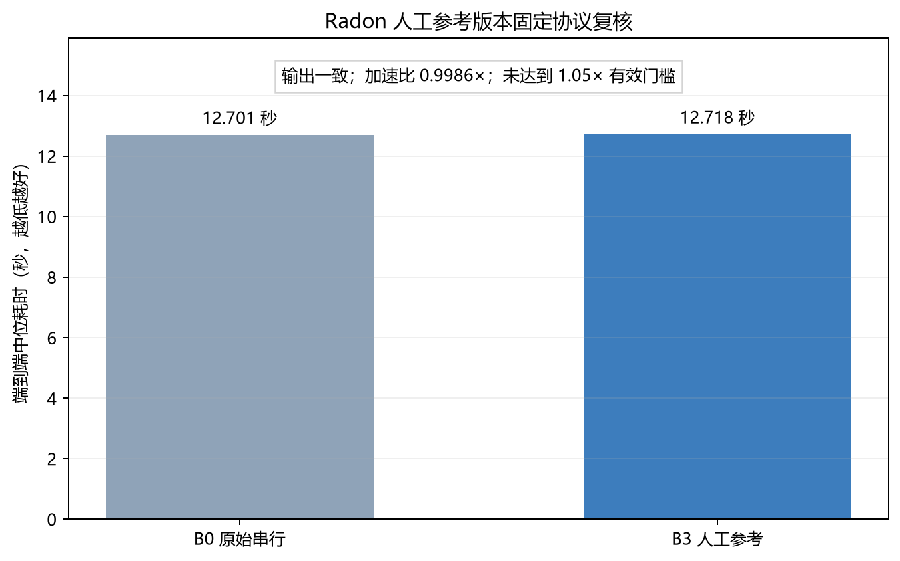

# 面向真实软件项目的 LLM Agent 自动并行化研究

## 摘要

本项目研究通用代码 Agent 能否把真实的多文件 Python 项目可靠地改成并行版本。与只给一个
循环添加并行语法不同，真实项目还包含跨文件调用、共享状态、排序与异常行为、安装环境和公开
入口。并行修改即使能够运行，也可能输出错误，或因为进程启动和数据传递开销使整个程序变慢。

项目首先让普通 Agent 独立并行化 Radon、Vulture、Chardet 和 MkDocs，每个项目运行 3 次。
12 次运行中没有一次形成有效并行版本：6 次留下错误修改，6 次没有形成可用方案。根据这些
现象，本项目提出：项目级自动并行化不应被看成一次代码生成，而应被看成一个允许拒绝候选的
决策过程。改进方法在生成前固定源码位置和项目语义，在生成后用原项目测试、固定输出、实际
并行结构和配对端到端计时检查候选；证据不合格时继续修复，仍不合格则恢复串行版本。

在相同四个项目上的 12 次改进 Agent 运行中，1 次形成有效并行版本，10 次安全回退，1 次没有
形成方案，没有留下已知错误修改。唯一有效结果来自 Chardet，端到端中位加速为 3.251 倍。
MkDocs 小规模消融显示，只增加语义说明仍会留下错误修改，而加入真实验证和回退后，3 个不合格
候选均未交付。结果支持“执行证据和拒绝选项能降低错误交付”，但 1/12 的有效并行率也说明，
当前方法还不能稳定完成自动加速。

## 1. 研究背景与问题

已有并行代码研究表明，评价生成结果不能只看语法，还要检查正确性和运行性能。仓库级代码
研究进一步说明，真实项目中的上下文检索、跨文件关系、构建和测试都会增加难度。执行反馈类
工作说明，实际运行时间可以帮助模型继续优化代码。但这些工作仍没有直接回答：通用 Agent 从
真实串行项目中自行寻找并行机会时，怎样避免交付“看起来并行、实际上不可用”的修改。

本项目研究问题为：

> 在模型、项目、工具和运行次数保持一致时，加入项目语义约束、真实执行反馈和安全回退，能否
> 降低普通 Agent 并行化真实项目时的错误交付率，同时保留真正有效的并行候选？

可被实验否定的假设是：如果这些检查有用，改进 Agent 的错误交付率应低于普通 Agent；如果它
仍频繁保留测试失败、输出错误或整体变慢的补丁，则假设不成立。安全回退和有效加速分开统计，
避免把“没有破坏项目”包装成“成功并行化”。

## 2. 相关工作与研究空白

ParEval 同时检查 LLM 并行代码的正确性和性能；ParEval-Repo 把评价扩展到仓库级 HPC 代码
迁移。CodeAgent、RepoExec 等工作强调真实仓库任务需要检索、工具使用和可执行上下文。
PerfCodeGen 将运行时间反馈给模型继续优化。SWE-Perf 等真实仓库性能基准则说明，端到端性能
优化明显难于普通代码修复。

本项目不重复“模型能否写出某种并行语法”，而关注一个更窄的空白：当 Agent 自己选择真实
项目中的并行位置并修改原入口时，怎样用项目证据决定候选能不能交付。详细论文对照、原文链接
和局限见 `docs/related-work.md`。

## 3. 真实项目与实验协议

| 项目 | 固定版本 | 固定工作负载 | 主要风险 |
|---|---|---|---|
| Radon | 6.0.1 | 批量分析 Python 文件并汇总复杂度 | 对象状态、进程传参、排序 |
| Vulture | 2.16 | 扫描项目并找出未使用代码 | 跨文件共享分析状态 |
| Chardet | 7.0.0.dev0 | 批量检测真实字节文件编码 | 结果顺序、进程启动成本 |
| MkDocs | 1.6.1 | 构建官方完整文档站点 | 插件状态、页面上下文、链接 |

所有正式 Agent 运行使用相同模型类别、工具权限、最大修改轮数和 1.05 倍有效加速门槛。每次
实验从固定源码副本开始，先运行原项目测试和串行基线，再允许 Agent 修改。候选性能与同次实验
的串行版本配对比较。最终计时预热 1 次、正式运行 5 次并取中位数。

有效并行化必须同时满足：

1. 原项目测试通过；
2. 固定端到端输出与串行版本一致；
3. 修改中存在实际线程或进程并行；
4. 端到端中位加速至少为 1.05 倍。

## 4. 诊断实验：普通 Agent 为什么失败

普通 Agent 共运行 12 次，结果为 6 次错误修改、6 次未形成方案、0 次有效并行。真实失败不是
单一的“模型不会写进程池”，而是分布在整个项目修改过程：

- 修改后原项目测试失败；
- 固定工作负载输出顺序或内容变化；
- 生成了并行代码，但没有接入真实入口；
- 修改把复杂对象或状态送入子进程；
- 局部任务能够并行，但启动、传参和合并开销抵消收益；
- 候选能运行且输出正确，但端到端程序反而变慢。

一个特别容易误判的现象是：进程正常退出且耗时很短，但真实计算已变成异常记录。只看退出码
或局部计时会把错误程序当作高速程序。因此本项目把原测试、固定输出和端到端计时同时作为证据。

## 5. 核心观点与方法

诊断后形成的核心观点是：

> 项目级自动并行化不是一次性生成并行语法，而是带拒绝选项的决策过程。项目测试、固定输出
> 和配对端到端性能共同决定候选是否值得交付；证据不合格时保留串行版本更可靠。

方法流程如下：

```text
固定串行项目
  → 验证源码来源、原测试、固定输出和串行性能
  → Agent 阅读入口、调用关系和项目状态
  → 先写出任务输入输出、共享状态、顺序和异常约束
  → 用源码位置与内容哈希限制修改范围
  → 生成并行候选
  → 原测试 → 固定输出 → 实际并行结构 → 配对端到端性能
  → 合格则保留；不合格则带证据修复；仍失败则恢复串行版
```

这里的主要研究改变不是增加更多调度功能，而是改变“何时允许交付”的决策规则。回退能够
阻止已知坏补丁进入最终代码，但不会被计为加速成功。

## 6. 主实验结果

| 方法 | 运行数 | 有效并行 | 安全回退 | 错误修改 | 未形成方案 |
|---|---:|---:|---:|---:|---:|
| B1 普通 Agent | 12 | 0 | 0 | 6 | 6 |
| B2 完整方法 | 12 | 1 | 10 | 0 | 1 |


完整方法一共检查了 30 个候选：17 个项目测试失败，4 个输出或集成失败，3 个没有真实并行
结构，3 个加速不足 5%，2 个整体变慢，只有 1 个被接受。


唯一有效结果来自 Chardet，端到端中位加速为 3.251 倍。这个案例证明系统不是永远回退，但
1/12 的成功率也不能支持“已经能够稳定自动加速真实项目”。

## 7. 消融实验

在 MkDocs 上增加 A1 组：保留源码位置和语义约束，但去掉候选性能反馈与自动回退。

| 方法 | 错误修改 | 安全回退 | 未形成方案 |
|---|---:|---:|---:|
| B1 普通 Agent | 2 | 0 | 1 |
| A1 只加语义约束 | 2 | 0 | 1 |
| B2 完整方法 | 0 | 3 | 0 |


每组只有 3 次，因此只能得到有限结论：在 MkDocs 上，事先写语义说明没有单独阻止错误补丁；
加入真实验证和回退后，不合格候选没有被交付。由于完整方法同时包含多个变化，这组实验还不能
精确区分项目测试、固定输出、性能反馈和回退各自贡献了多少。

## 8. 被反例修正的支线假设

Radon 的一次失败补丁暴露出 Worker 边界问题：绑定实例方法会连同复杂状态一起跨进程传递。
项目一度依据旧计时记录，认为人工状态最小版本可达到约 5.98 倍加速，并准备研究边界检查能否
帮助 Agent 生成更好的候选。

在继续实验前，项目用固定源码、干净副本、路径无关输出和 B0/B3 配对计时重新验证该前提。
399 项测试通过、5 项跳过，两版输出哈希相同；但 B0 中位耗时为 12.7008 秒，B3 为 12.7182 秒，
加速仅 0.9986 倍，未达到 1.05 倍门槛。



因此旧的 5.98 倍性能结论被撤回，Worker 边界支线按前提失效终止。这个反例带来的认识是：
减少跨进程状态能够解决一类正确性问题，但不自动等于端到端加速。继续研究候选生成机制前，
应先证明选定工作负载存在可复现的人工并行收益。

## 9. 复现与证据

四个项目均固定源码提交、依赖和外部测试数据。项目已在全新目录重新下载并运行原测试与串行
基线；四个项目的测试、路径无关输出哈希和基线核对均通过。27 次正式 Agent 运行分别保留提示、
回复、事件日志、补丁、项目验证和排除记录。`docs/data/research-evidence-manifest.json` 为本地
原始证据保存路径、大小和 SHA-256 哈希。

主要复现入口：

- 环境与逐步命令：`docs/reproducibility.md`；
- 四项目从零重建：`scripts/bootstrap_candidate_projects.py`；
- 测试、基线与哈希核对：`scripts/verify_candidate_reproduction.py`；
- 主实验汇总和中文图：`scripts/summarize_m6_study.py`；
- Radon 人工参考复核：`scripts/verify_radon_manual_reference.py`。

## 10. 结论与局限

本项目验证了普通 Agent 在真实项目级并行化中会频繁产生错误或无效修改。加入源码来源检查、
项目语义约束、真实执行反馈和安全回退后，当前样本中的已知错误交付从 6/12 降为 0/12，同时
保留了 1 个真实有效候选。这支持“并行化候选必须以项目证据决定是否交付”的观点。

但本项目没有证明自动并行化问题已经解决。主要局限包括：只有 4 个项目；每种方法只有 12 次
运行；消融每组只有 3 次；完整方法包含多个共同变化；只覆盖 Windows 单机 CPU；项目测试不能
代表所有未测试输入；Agent 有效加速率仍只有 1/12。未来工作应先建立更多带可复现人工并行
收益的真实项目任务，再针对一种反复出现的生成失败设计单变量方法，而不是继续堆叠功能。

## 参考文献

1. Nichols et al. *Can Large Language Models Write Parallel Code?* HPDC 2024.
2. Davis et al. *ParEval-Repo: A Benchmark Suite for Evaluating LLMs with Repository-level HPC Translation Tasks.* 2025.
3. Peng et al. *PerfCodeGen: Improving Performance of LLM Generated Code with Execution Feedback.* 2024.
4. Zhang et al. *CodeAgent: Enhancing Code Generation with Tool-Integrated Agent Systems for Real-World Repo-level Coding Challenges.* ACL 2024.
5. Hai et al. *On the Impacts of Contexts on Repository-Level Code Generation.* Findings of NAACL 2025.
6. Moritz et al. *Ray: A Distributed Framework for Emerging AI Applications.* OSDI 2018.
7. He et al. *SWE-Perf: Can Language Models Optimize Code Performance on Real-World Repositories?* 2025.

完整链接和逐篇对照见 `docs/related-work.md`。
