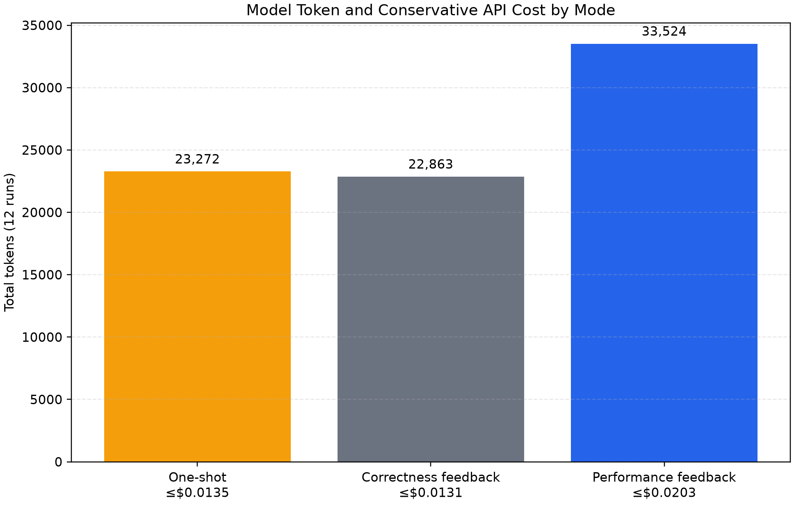

# 正式在线 Agent 消融实验

实验日期：2026-07-29

## 1. 研究问题

本实验回答：

> 在自动并行化中，执行正确性反馈是否足够？加入端到端性能反馈后，能否减少
> “代码正确但运行更慢”的结果？

## 2. 方法

### 2.1 三组对照

| 模式 | 一次生成 | 错误/正确性反馈 | 性能反馈 | 串行回退 |
|---|---:|---:|---:|---:|
| One-shot | 是 | 否 | 否 | 否 |
| Correctness feedback | 是 | 是 | 否 | 否 |
| Performance feedback | 是 | 是 | 是 | 是 |

### 2.2 Benchmark

| 任务 | Large 规模 | 主要特征 |
|---|---:|---|
| Prime Count | 32 | CPU 密集、低通信 |
| Tiny Tasks | 2000 | 任务粒度边界 |
| Word Count | 32 | 文本输入与归约 |
| Pairwise Distance | 16 | 大数组输入与序列化 |

### 2.3 重复规范

- 4 个任务 × 3 种模式 × 3 次独立模型运行，共 36 个作业；
- 每个作业内，串行和并行候选各运行 3 次；
- 使用固定种子随机打乱串行/并行执行顺序；
- 所有候选必须通过输出一致性门控；
- 报告独立模型运行间的均值与标准差；
- 原始 JSON、模型轨迹、单次运行和汇总 CSV 全部保存；
- 实验支持断点续跑和模型调用/Token 双预算保护。

### 2.4 不确定性感知性能 Gate

定义中位端到端加速：

\[
S_{\mathrm{median}} =
\frac{\mathrm{median}(T_{\mathrm{serial}})}
{\mathrm{median}(T_{\mathrm{parallel}})}
\]

同时定义保守加速：

\[
S_{\mathrm{conservative}} =
\frac{Q_1(T_{\mathrm{serial}})}
{Q_3(T_{\mathrm{parallel}})}
\]

只有同时满足：

\[
S_{\mathrm{median}} \ge 1.05,\qquad
S_{\mathrm{conservative}} \ge 1.00
\]

才保留并行候选。否则把实测时间、任务数、Worker 与 Chunk 反馈给性能控制器，
由其调整计划或回退串行。

## 3. 完整性

| 指标 | 结果 |
|---|---:|
| 计划作业 | 36 |
| 完成作业 | 36 |
| 正确作业 | 36 |
| 失败作业 | 0 |
| 预算跳过 | 0 |
| 模型调用 | 81 |
| 总 Token | 79,659 |

## 4. 分任务结果

表中是最终执行决策后的端到端加速均值 ± 标准差。

| 任务 | One-shot | Correctness | Performance |
|---|---:|---:|---:|
| Pairwise Distance | 0.656 ± 0.003 | 0.640 ± 0.011 | **1.000 ± 0.000** |
| Prime Count | 2.003 ± 0.066 | 2.045 ± 0.045 | **2.028 ± 0.022** |
| Tiny Tasks | 1.090 ± 0.019 | 1.065 ± 0.036 | 1.053 ± 0.047 |
| Word Count | 0.579 ± 0.014 | 0.564 ± 0.021 | **1.000 ± 0.000** |


主要观察：

1. Prime Count 三组都保留并行并达到约 2 倍加速，说明性能 Gate 不是一律
   回退；
2. Word Count 和 Pairwise Distance 的一次性与正确性反馈组全部出现显著
   退化；
3. 性能反馈组对上述两类任务全部回退串行；
4. Tiny Tasks Large 位于 1.05 倍阈值附近，三次性能组运行中有一次回退，
   显示边界任务受运行噪声影响，报告均值与方差是必要的。

## 5. 总体结果

每种模式共有 12 个作业。

| 模式 | 正确率 | 性能退化率 | 串行回退率 | 宏平均有效加速 |
|---|---:|---:|---:|---:|
| One-shot | 100% | 50% | 0% | 1.082x |
| Correctness feedback | 100% | 50% | 0% | 1.079x |
| Performance feedback | 100% | **0%** | 58.3% | **1.270x** |


这支持以下结论：

> 只加入正确性反馈不能避免有害并行；加入端到端性能反馈与串行回退后，
> 本实验中的性能退化率由 50% 降至 0%，同时保留了计算密集任务的有效加速。

## 6. 模型与成本

模型路由：

- 依赖分析、错误修复、性能决策：`deepseek-v4-pro`，开启思考；
- 结构化计划整理：`deepseek-v4-flash`，关闭思考。

| 模式 | 模型调用 | Token | 保守费用上界 |
|---|---:|---:|---:|
| One-shot | 24 | 23,272 | $0.0135 |
| Correctness feedback | 24 | 22,863 | $0.0131 |
| Performance feedback | 33 | 33,524 | $0.0203 |
| 合计 | 81 | 79,659 | $0.0470 |



费用按 2026-07-29 DeepSeek 官方价格快照、全部输入按缓存未命中估计，因此是
保守上界，实际账单可能更低。价格会变化，复现实验时应重新核对
[DeepSeek 官方 Models & Pricing](https://api-docs.deepseek.com/quick_start/pricing/)。

## 7. 当前可以与不可以声称的内容

### 可以声称

- 运行正确性与运行效率是两个不同门控；
- 当前四类任务中，只看正确性会保留明显变慢的并行候选；
- 实测性能反馈与串行回退显著降低性能退化率；
- 分层模型路由可以把高成本推理集中在关键决策；
- 全部结果具有原始日志、重复测量和断点续跑证据。

### 不可以声称

- 不能声称支持任意 Python 项目；
- 不能把 multiprocessing 数据写成 Ray 性能；
- 不能由四类任务推断对所有工作负载均有效；
- 当前候选代码由显式函数契约和确定性模板生成，尚未充分评价自由形式 LLM
  代码重构能力；
- 没有多机、GPU、仓库级和真实业务代码结果。

## 8. 后续实验

1. 加入自由形式 LLM Patch 生成，并保留当前模板作为受控基线；
2. 增加 Worker/Chunk 搜索消融；
3. 增加通信感知任务融合；
4. 在 Linux/Ray 环境复现实验；
5. 扩充到 8～10 个 Benchmark；
6. 计算 Agent 离线转换成本的摊销次数。

## 9. 复现

```powershell
parallel-agent agent-experiment configs/agent_experiment_formal.yaml `
  --output-dir results/raw/agent_formal_20260729 `
  --adapter deepseek
```

中断后执行同一条命令会自动跳过已有 `run_report.json` 的作业并继续。

可提交的汇总数据：

- `docs/data/formal_agent_20260729/agent_experiment_summary.csv`
- `docs/data/formal_agent_20260729/agent_experiment_aggregate.csv`
- `docs/data/formal_agent_20260729/agent_experiment_overall.csv`
