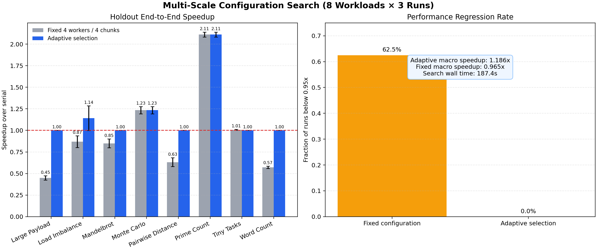

# 多尺度 Worker/Chunk 搜索与性能回退正式实验

日期：2026-07-29

## 1. 研究动机

固定使用 CPU 核心数作为 Worker 数、每个 Worker 一个 Chunk，是最常见的朴素
并行策略，但它忽略三类成本：

1. 任务太细时的进程启动和调度开销；
2. 大输入下的序列化与数据传输开销；
3. 任务耗时不均匀时的负载失衡。

本模块不让 LLM 猜参数，而是把可复现的性能测量作为 Agent 工具，回答：

> 当前程序是否值得并行？如果值得，Worker 和 Chunk 应如何选择？为了得到参数
> 花费的搜索成本，需要运行多少次才能摊销？

## 2. 方法

### 阶段一：小样本参数搜索

搜索空间：

```text
Worker ∈ {1, 2, 4}
每个 Worker 的 Chunk 倍数 ∈ {1, 2, 4}
```

每个配置在较小输入上运行两次。配置必须：

- 与串行结果指纹一致；
- `task_count` 符合 Chunk 契约；
- 中位加速不低于 1.05；
- 保守加速 `Serial Q1 / Parallel Q3` 也不低于 1.05。

否则初步选择串行。

### 阶段二：完整规模确认

小输入上的决策不能直接外推到大输入。只要小样本选择的不是固定 `4/4`，系统就在
完整规模上比较：

- 串行；
- 小样本候选；
- 固定 `4 Worker / 4 Chunk`。

候选只有同时满足以下条件才替换固定配置：

```text
候选相对串行的中位与保守加速均 ≥ 1.05
候选相对固定配置的中位优势 ≥ 5%
Fixed Q1 / Candidate Q3 ≥ 1.0
```

若候选与固定都没有可信收益，则选择串行。

### 阶段三：独立留出评测

参数选择完成后，再使用未参与选择的五次随机顺序测量报告最终结果。调参数据和
留出数据严格分开，避免从同一批计时中选出最快配置后又用它证明自己最快。

## 3. Benchmark

正式实验包含 8 类任务，每类独立运行 3 次：

- Prime Count：计算密集、均匀任务；
- Monte Carlo：计算密集但存在运行波动；
- Mandelbrot；
- Tiny Tasks：细粒度调度开销；
- Word Count：文本序列化；
- Pairwise Distance：大数组数据传输；
- Load Imbalance：重任务集中在连续输入前部；
- Large Payload：每项 128 KiB、计算极轻。

最后两个是本阶段新增的边界任务，分别验证负载均衡和通信开销。

## 4. 总体结果

| 指标 | 固定 4 Worker / 4 Chunk | 多尺度自适应选择 |
|---|---:|---:|
| 任务数 | 8 | 8 |
| 独立作业 | 24 | 24 |
| 宏平均有效加速 | 0.965x | **1.186x** |
| 性能退化率（低于 0.95x） | 62.5% | **0%** |
| 完成失败 | 0 | 0 |

自适应方法在 62.5% 的作业中避免了固定配置的性能退化。



## 5. 分任务结果

| Workload | 固定加速 | 自适应加速 | 自适应决策 |
|---|---:|---:|---|
| Large Payload | 0.449x | **1.000x** | 串行 |
| Load Imbalance | 0.869x | **1.141x** | 两次并行优化、一次保守串行 |
| Mandelbrot | 0.850x | **1.000x** | 串行 |
| Monte Carlo | 1.234x | **1.234x** | 保留固定 4/4 |
| Pairwise Distance | 0.632x | **1.000x** | 串行 |
| Prime Count | 2.111x | **2.111x** | 保留固定 4/4 |
| Tiny Tasks | 1.006x | 1.000x | 串行，差异不足阈值 |
| Word Count | 0.572x | **1.000x** | 串行 |

### 负载不均衡

固定四块会把前部的重任务集中到一个 Worker，其他 Worker 提前空闲。增加 Chunk
后，重任务可以分散调度。三次实验中，自适应相对固定配置平均快 1.315 倍；两次
通过完整规模确认选择更细粒度，一次因证据不足保守回退串行。

### 大载荷轻计算

每个数据项包含 128 KiB，但 `unit()` 只执行快速求和。固定进程并行平均只有
0.449 倍，自适应稳定选择串行，相对固定方案平均快 2.231 倍。这直接说明数据
传输成本可能完全抵消并行计算收益。

## 6. 搜索成本与摊销

24 个作业的参数搜索总墙钟时间约 187.4 秒，平均每个作业约 7.8 秒。搜索不是
免费的，因此必须与重复执行次数一起解释。

代表性结果：

- Prime Count 相对串行约运行 17 次后摊销搜索成本；
- Monte Carlo 相对串行约 103 次后摊销；
- Load Imbalance 相对固定方案约 87 次后摊销；
- Large Payload 通过避免固定并行，约 42 次后摊销；
- Word Count 通过避免固定并行，约 53 次后摊销。

对于只运行一次的短程序，完整搜索未必值得；实际系统应缓存相同代码与输入规模的
配置，或使用更少的探测候选。

## 7. 结论

本实验支持以下结论：

1. Worker 数量越多、Chunk 越细并不必然更快；
2. 小样本决策存在尺度迁移风险，必须进行完整规模确认；
3. 参数选择数据和最终评测数据必须分开；
4. 相对固定配置设置最小收益门，可以减少对噪声的过拟合；
5. 自适应选择的主要价值不仅是提高峰值加速，还包括拒绝有害并行；
6. 搜索开销必须通过摊销次数纳入“整体执行效率”。

这构成当前项目最主要的效率贡献：Agent 不只是生成并行代码，而是调用测量工具，
在固定并行、优化并行和串行之间做有证据的选择。

## 8. 复现

```powershell
parallel-agent configuration-search-experiment `
  configs/configuration_search_formal.yaml `
  --output-dir results/raw/configuration_search_formal_final_v2_20260729
```

生成图表：

```powershell
parallel-agent plot-configuration-search `
  results/raw/configuration_search_formal_final_v2_20260729/configuration_search_aggregate.csv `
  results/raw/configuration_search_formal_final_v2_20260729/configuration_search_overall.json `
  --output-dir docs/assets/configuration_search_formal_20260729
```

版本化的汇总数据和代表性完整运行记录保存在
`docs/data/configuration_search_20260729/`。
