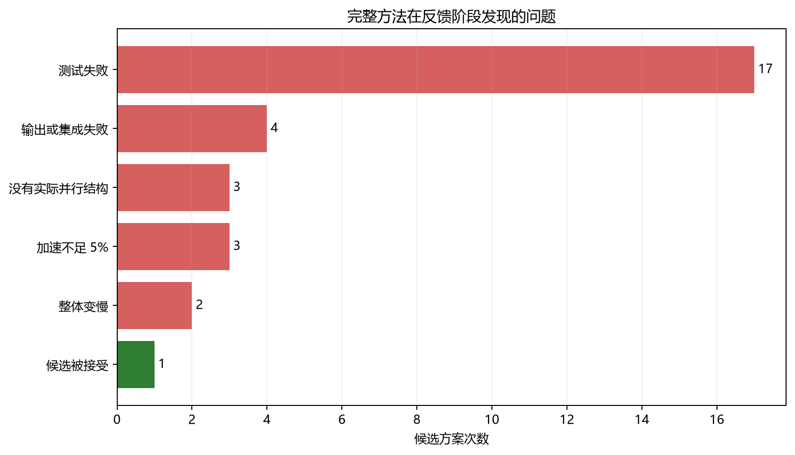
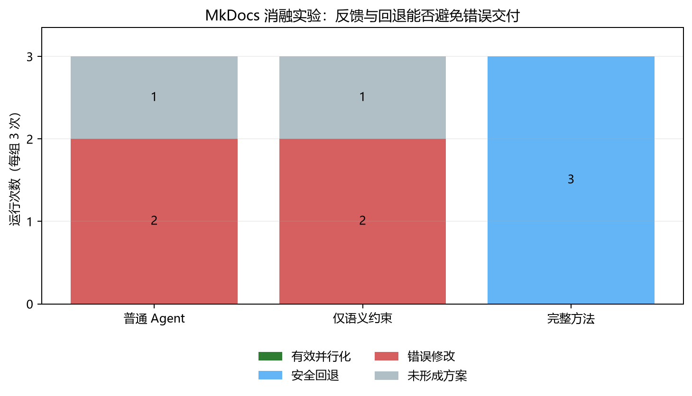

# M6 真实项目实验发现

## 1. 本阶段回答的问题

本阶段不再验证“LLM 会不会写 `ProcessPoolExecutor`”，而是观察它能否把一个真实的
多文件串行项目改成**仍然正确、真正接入原入口、并且整体更快**的版本。

实验使用 Radon、Vulture、Chardet 和 MkDocs 四个开源项目。每次运行都从固定源码副本
开始，保留模型读取记录、修改、项目测试、固定工作负载输出和端到端计时。普通 Agent 和
完整方法各独立运行 12 次，即每个项目 3 次。

## 2. 主要观察

普通 Agent 的 12 次运行中：

- 6 次留下了测试不通过或输出不一致的修改；
- 6 次没有形成可用补丁；
- 0 次达到“结果正确且端到端加速至少 5%”。

完整方法的 12 次运行中：

- Chardet 有 1 次得到有效并行版本，端到端加速为 3.251 倍；
- 10 次发现候选不正确、无明显收益或变慢后，恢复了原串行代码；
- 1 次在分析阶段没有形成方案；
- 没有把已知错误或变慢的修改作为最终结果留下。

这里必须区分两个结论：完整方法的**有效并行成功率只有 1/12**，说明问题仍然很难；但它
能够阻止大量不可靠修改进入最终结果，说明“验证后再决定是否保留”是有作用的。

## 3. Agent 实际遇到的困难

完整方法共实际检查了 30 个候选方案，其中只有 1 个被接受。其余候选的问题为：

| 问题 | 次数 | 在项目中的表现 |
|---|---:|---|
| 项目测试失败 | 17 | 共享状态、插件状态、异常行为或调用方式被改变 |
| 输出或集成失败 | 4 | 单个函数能运行，但原项目入口的最终结果发生变化 |
| 没有实际并行结构 | 3 | 模型解释很多，但修改中没有真正提交并行任务 |
| 加速不足 5% | 3 | 代码正确，但并行管理成本抵消了计算收益 |
| 整体变慢 | 2 | 新建进程、传输数据或重复初始化使端到端时间增加 |
| 候选被接受 | 1 | Chardet 的进程并行既保持输出，也有稳定整体收益 |

这些数据说明，真实项目并行化的主要难点不是写并行语法，而是同时守住项目语义和端到端
收益。只要这两项中任意一项没有验证，Agent 就可能交付“看起来并行、实际上不能用”的代码。

## 4. 消融实验

为了判断完整方法中的反馈与回退是不是多余功能，在 MkDocs 上增加了 3 次“只给语义约束、
不给性能反馈与自动回退”的独立运行。结果是：

- 普通 Agent：2 次错误修改，1 次没有形成方案；
- 只加语义约束：2 次错误修改，1 次没有形成方案；
- 完整方法：3 次都发现候选不合格并安全回退。

这个小规模消融不能证明语义约束在所有项目上都无效，只能说明：在 MkDocs 这种带插件状态、
输出顺序和构建上下文的项目中，**让模型事先写出约束并不足以保证修改正确，真实测试、固定
输出和端到端计时仍然不可缺少**。

## 5. 当前 insight

本阶段得到的观点是：

> 项目级自动并行化不应被当成“一次代码生成”，而应被当成带拒绝选项的决策过程。Agent
> 必须用原项目测试、固定输出和配对性能测量检查候选；证据不足时，保留串行版本比强行交付
> 并行修改更可靠。

这个观点不是说“回退就是并行化成功”。恰恰相反，1/12 的有效并行结果说明生成能力还很弱。
当前方法首先解决的是错误交付问题，下一步才是提高在安全边界内找到有效并行方案的概率。

## 6. 可追溯数据

- 紧凑结果：`docs/data/m6-study-summary.json`；
- 表格数据：`docs/data/m6-study-summary.csv`；
- 图表生成：`scripts/summarize_m6_study.py`；
- 普通 Agent 原始实验：`results/m5/corrected-b0/`；
- 完整方法原始实验：`results/m5/corrected-final/`；
- MkDocs 消融原始实验：`results/m6/ablation-contract-only/`。

原始实验目录体积较大，默认留在本机；仓库提交紧凑结果、生成脚本和实验说明。
