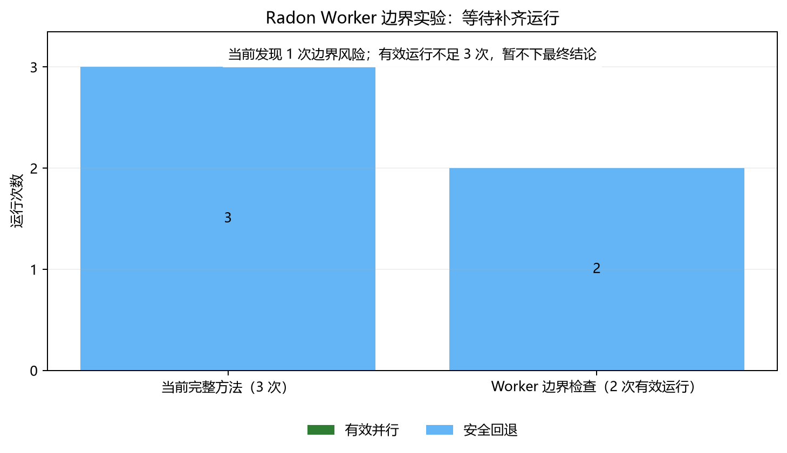

# M7 Worker 边界证据实验设计

## 1. 现象来源

Radon 的一次失败补丁把 `self._analyze_file` 直接提交给进程池。Windows 子进程不仅需要接收
这个方法，还要接收它所属的 `Harvester` 对象和动态配置，最终在反序列化时失败。人工参考
版本把 Worker 移到模块顶层，只传文件名和少量布尔值，并在主进程排序和聚合，得到约 5.98 倍
端到端加速。

完整方法虽然要求 Agent 在契约里描述序列化风险，但这仍是模型自己写的说明，没有自动检查
候选代码是否违背说明。

## 2. 可证伪假设 H5

> 在完整方法中加入高置信度的进程 Worker 边界检查，并把具体源码位置反馈给 Agent，可以
> 减少“把复杂实例状态或不可稳定序列化的可调用对象送入子进程”造成的候选失败，并提高
> Radon 上正确候选或有效并行候选的比例。

假设可能被否定：如果检查虽然能发现旧错误，但新运行仍无法形成正确候选，或误拒绝本来有效
的候选，那么它只是一条诊断规则，尚未改善 Agent 的实际并行化能力。

## 3. 唯一新增机制

在每轮修改后、运行昂贵项目测试前，对本轮修改的 Python 文件做 AST 检查。仅报告以下
高置信度模式：

- 把 `self.method` 或 `cls.method` 作为进程 Worker；
- 把嵌套函数或 `lambda` 作为进程 Worker；
- 把 `self`、`cls` 或其属性直接作为任务参数；
- 把 `lambda` 作为任务参数。

发现风险时，不直接声称代码必错，而是把文件、行号和原因反馈给 Agent，要求改成模块顶层
Worker，只传最小数据，并把动态状态与聚合留在主进程。没有发现风险也不代表正确，候选仍要
通过原项目测试、固定输出和端到端性能门控。

## 4. 对照

| 组别 | 源码锚点 | 语义契约 | 性能反馈与回退 | Worker 边界检查 |
|---|---:|---:|---:|---:|
| F：当前完整方法 | 是 | 是 | 是 | 否 |
| W：边界证据方法 | 是 | 是 | 是 | 是 |

两组保持 DeepSeek 模型、温度、最大回合、最大修改轮数、项目版本、测试、输入、配对计时和
1.05 倍接受阈值一致。F 组使用已经冻结的修正后结果，不重新挑选。

## 5. 实验范围

第一阶段在 Radon 独立运行 3 次。Radon 同时具备：

- 已重复出现的进程状态传递失败；
- 人工正确版本和 5.98 倍上界；
- 399 项项目测试和固定端到端输出。

如果 W 组至少形成一个正确候选，再在 Chardet 做保留性检查，观察该规则是否会妨碍已有的
有效进程并行方案。若 Radon 3 次均不能改善，不扩大实验，也不把规则包装成已解决问题。

## 6. 指标

1. 边界检查触发次数和问题类型；
2. 正确候选次数；
3. 有效并行次数；
4. 安全回退次数；
5. 测试、输出或性能失败次数；
6. Agent 调用次数和 Token；
7. 相对人工参考上界的加速差距。

## 7. 实现前回放

同一检查器对两份已经冻结的 Radon 代码回放：

- 失败 Agent 版本：在 `radon/cli/harvest.py` 第 97 行报告
  `bound_instance_worker`；
- 人工参考版本：识别到 1 个进程提交点，但没有报告高置信度边界风险。

该回放只用于确认规则与已知根因一致，不计入新实验结果。

## 8. 实验结果

> **校正状态（2026-08-08）：暂未完成。** 初次汇总把两次 Python 语法错误也归入
> `worker_boundary_failure`，从而把 1 次真实边界风险误写成 3 次。受影响的 run-03 已按协议
> 排除。修复分类器后的替代 run-04 在首次模型调用时遇到 DeepSeek 余额不足，未产生候选，
> 同样排除。当前只有 2 次有效 W 组运行，必须补齐第 3 次后才能判断 H5。

| 组别 | 运行数 | 有效并行 | 安全回退 |
|---|---:|---:|---:|
| F：当前完整方法 | 3 | 0 | 3 |
| W：边界证据方法 | 2（待补 1 次） | 0 | 2 |

两次有效 W 组运行中，只有 1 次出现真实 `instance_state_argument` 边界风险。Agent 修掉该
风险后仍出现固定输出不一致。另一次没有触发边界规则，候选仍因测试失败或没有实际并行而
回退。由于有效运行数不足 3 次，当前不能写“H5 被支持”或“H5 被否定”，也不启动 Chardet
扩展实验。

当前中间结果提示项目语义不能被压缩成单一序列化规则，但该解释要等补跑结束后再冻结。
