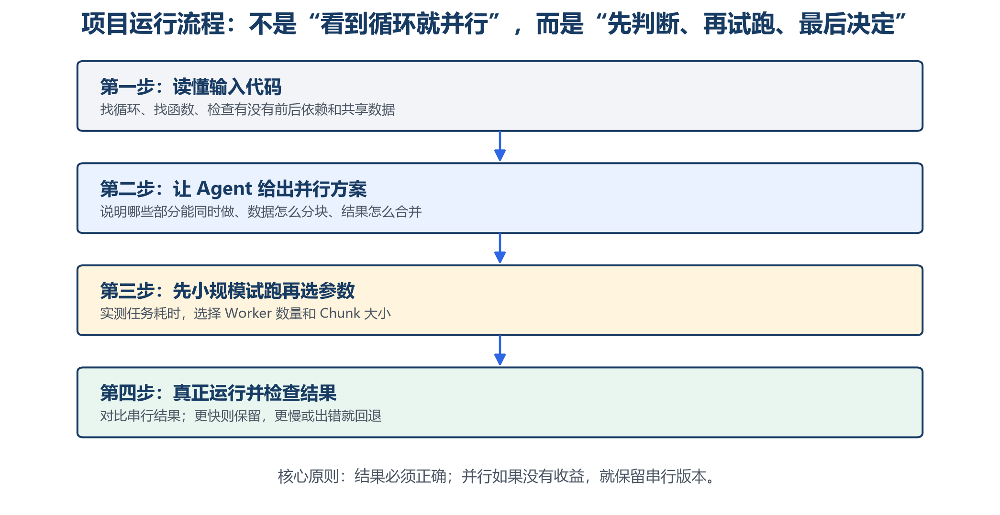
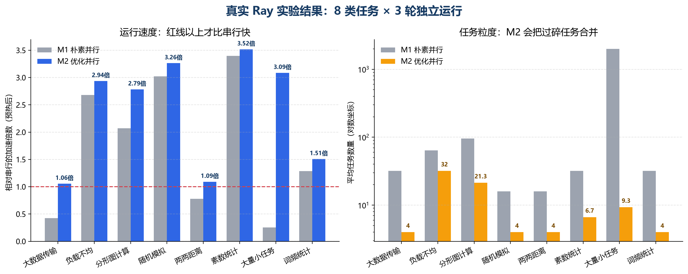
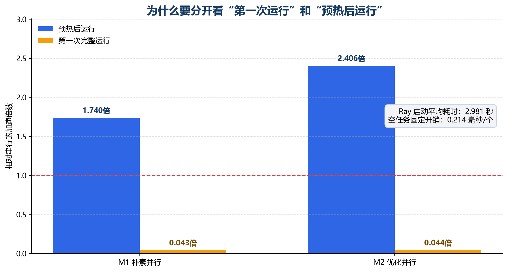

## 汇报内容

本次汇报主要说明五个问题：

1. 项目为什么不能停留在“把循环改成 Ray”；
2. 系统目前实现了哪些功能；
3. 实验如何设置，结果是否可信；
4. 开发过程中遇到了哪些问题，我如何修改原来的判断；
5. 当前结果的边界以及下一阶段准备做什么。

目前已经完成普通 Python 循环的分析与转换、Ray 候选代码执行、正确性比较、性能测量、Worker/Chunk 搜索和性能回退。在 WSL2 的单节点 Ray 环境中完成了 8 类工作负载、3 次独立实验，共得到 360 个正式计时样本。最终候选均通过正确性检查。

| 项目 | 当前状态 |
|---|---|
| 串行代码到 Ray 候选代码 | 已完成 |
| 依赖检查与危险模式识别 | 已完成常见模式 |
| Worker 与 Chunk 搜索 | 已完成 |
| 正确性检查和性能回退 | 已完成 |
| WSL2 单节点 Ray 实验 | 已完成 |
| 真实多机实验 | 尚未完成 |

[PAGEBREAK]

## 1. 研究问题与范围

大模型能够生成语法正确的并行代码，但这并不意味着程序一定更快。项目开始后，我在初步实验中遇到了三类现象：小任务拆分过细会被调度开销淹没；输入数据较大时，数据传输可能超过计算收益；不同任务耗时差异较大时，最慢的 Worker 会拖住整个程序。

因此，我把研究问题从“能否自动改成 Ray”调整为：

> 如何在保证结果正确的前提下，根据实际运行数据判断代码是否值得并行，并选择较合适的任务粒度？

当前范围限定为 Python 单文件或少量函数，以数据并行、Map-Reduce 和简单任务图为主。暂不处理大型代码仓库、复杂共享状态、GPU 内核和真实多机网络调度。

### 1.1 三组对照

| 方法 | 设置 | 作用 |
|---|---|---|
| M0 串行基线 | 保留原始 Python 实现 | 提供正确结果和时间基准 |
| M1 朴素并行 | 固定 Worker，按固定规则拆分任务 | 表示“直接改成 Ray”的方案 |
| M2 优化并行 | 依赖检查、试跑、参数搜索、任务合并和回退 | 本项目方法 |

设置 M1 的原因是：如果只比较 M0 和 M2，无法判断性能提高究竟来自并行本身，还是来自任务粒度和性能优化。

[PAGEBREAK]

## 2. 系统设计与核心方法

系统先读取原始代码，提取循环、函数调用、变量读写和共享状态。静态分析用于确认明确存在的依赖，大模型用于补充语义判断并生成结构化方案。候选代码生成后，不直接作为最终结果，而是经过真实执行。

### 2.1 依赖与正确性检查

系统重点识别独立任务、归约、循环携带依赖和共享副作用。例如 `a[i] = a[i-1] + x[i]` 存在跨迭代依赖，不能直接把各次循环同时执行。M1 和 M2 的输出必须与 M0 的黄金结果一致；错误、超时或异常候选不会进入性能统计。

### 2.2 性能试跑与参数选择

系统记录单项计算时间、任务数量、Ray 初始化时间、空任务开销、输入输出序列化大小和 CPU 使用情况。M2 先用较小输入试跑，再搜索少量 Worker 和 Chunk 组合。预测或实测没有收益时，系统保留串行版本。

### 2.3 大模型的作用

DeepSeek 主要负责普通代码语义分析、并行计划生成和失败修复。依赖门控、性能选择、正确性比较和是否回退由确定性程序及真实运行结果决定。这样做是因为模型擅长代码理解，但不适合直接猜测机器上的调度和传输成本。

## 3. 实验设计

主实验运行在 Windows 11 的 WSL2 中，使用真实 Ray 单节点后端。为避免 Ray Worker 内部再次开启多线程，实验固定相关数值库线程数为 1。

### 3.1 工作负载

| 类型 | 工作负载 | 主要考察问题 |
|---|---|---|
| 计算密集 | Prime Count、Mandelbrot、Monte Carlo | 数据并行和加速上限 |
| 归约与矩阵 | Word Count、Pairwise Distance | 合并成本和 Chunk 选择 |
| 边界任务 | Tiny Tasks、Large Payload | 调度开销和数据传输 |
| 负载不均 | Load Imbalance | 慢任务和任务分配 |
| 依赖反例 | Prefix Sum | 是否能拒绝错误并行 |

### 3.2 实验协议

- 8 类 Ray 工作负载进行 3 次独立实验，M0、M1、M2 使用相同输入、随机种子和 Worker 上限；
- 每种模式预热 1 次、正式计时 5 次，共得到 8 × 3 × 3 × 5 = 360 个正式计时样本；
- 报告多次运行中位数，同时保留失败和性能退化样本；正式实验前运行 78 项自动测试；
- 另记预热后时间与首次完整运行时间，并统计加速比、任务数和序列化开销。

[PAGEBREAK]

## 4. 主要实验结果

| 指标 | M1 朴素并行 | M2 优化并行 |
|---|---:|---:|
| 预热后宏平均加速比 | 1.740 倍 | 2.406 倍 |
| 性能退化率 | 37.5% | 0% |
| 获得性能提升的运行组合 | 62.5% | 91.7% |
| 正确性 | 100% | 100% |

M2 相对 M1 的几何平均运行时提升为 1.734 倍，并在 8 类工作负载中的 7 类胜出。

最明显的案例是 Tiny Tasks。M1 把 2000 个数据项拆成 2000 个 Ray 任务，预热后加速比只有 0.255。M2 将其批处理为平均约 9.3 个任务后，加速比提高到 3.087。Large Payload 和 Pairwise Distance 中，M1 的加速比也低于 1；M2 通过减少任务数量、控制数据传输或回退，分别达到 1.056 和 1.092。

Prime Count、Monte Carlo 和 Mandelbrot 本身计算量较大，M1 已经能够获得较好加速。M2 主要通过调整 Worker 和 Chunk，分别达到 3.518、3.264 和 2.785 倍。

[PAGEBREAK]

## 5. 第一次运行与重复运行

Ray 初始化平均耗时为 2.981 秒，空任务固定开销约为 0.214 毫秒/个。预热后 M2 的宏平均加速比为 2.406，但把初始化计算在内，第一次完整运行的宏平均加速比只有 0.044。

这个结果说明，项目目前更适合批处理、服务化或重复执行的程序，而不适合只运行一次的短任务。为避免只报告有利结果，我在实验中同时保留：

- 预热后运行时间，用于分析重复计算场景；
- 第一次完整运行时间，用于反映实际首次使用成本；
- 收支平衡次数，用于估计优化成本需要运行多少次才能回收。

当前收支平衡次数的中位数为 34.5 次。平均数明显更高，是因为有两类工作负载在预热后节省时间很少，因此报告中不只使用平均数。

[PAGEBREAK]

## 6. 研究过程中遇到的问题

### 6.1 任务数量并不是越多越好

刚开始接触 Ray 时，我认为把每个数据项都提交成独立任务，能够最大限度利用 CPU。Tiny Tasks 的结果与这个判断相反：代码正确，但 2000 个任务使程序比串行慢约 4 倍。

我随后单独测量空任务开销，并把任务计算时间与固定开销比较。修改后，系统先估计合适的初始 Chunk，再在附近进行小范围搜索。这个过程使我认识到，并行度不能只看任务数量，更重要的是每个任务的有效计算是否足以覆盖调度和序列化成本。

### 6.2 平均任务耗时不能解释负载不均

初版优化器使用平均任务耗时估计 Chunk。Load Imbalance 中，某次旧版 M2 只有约 1.086 倍加速，反而低于朴素方案。检查每个 Worker 的完成时间后发现，连续分块把较重的输入集中到了少数 Worker。

我增加了分层抽样、任务耗时变异系数和慢任务惩罚。当样本耗时差异较大时，系统倾向于产生更多 Chunk，让 Ray 有机会重新分配任务。正式结果中，M2 的加速比达到 2.938，高于 M1 的 2.680。

[PAGEBREAK]

### 6.3 预热结果不能代表第一次使用

最初看到多个任务的预热加速比超过 2 时，我曾准备直接用“并行代码更快”概括结果。加入 Ray 初始化计时后，第一次完整运行的结果完全不同。

因此，我重新划分评价口径，分别记录冷启动、预热后运行和收支平衡次数。这个修改没有让数字更好看，但使结论与实际使用场景一致。

### 6.4 运行环境和证据边界

早期在 Windows 环境中遇到中文路径、临时目录过长和 Ray 通信路径不稳定的问题。主实验后来迁移到 WSL2，并使用较短的临时目录。由此我意识到，运行环境不是附属信息，它会直接影响分布式实验是否可复现。

另外，成功连接 Ray Head 并不等于完成了多机实验。当前证据记录了物理节点数量、执行节点 ID 和是否跨节点执行。正式结果只证明单台物理机器上的真实 Ray 任务运行，不能表述为多机网络实验。

### 6.5 Agent 需要保留原始语义

普通循环前端曾把原函数包装成统一接口，导致 DeepSeek 只看到包装层，无法判断原函数是否修改共享状态。修改后，系统同时保存原始源码和规范化源码，并用哈希绑定二者。这个问题使我认识到，多阶段 Agent 在传递结构化结果时，也必须保留能够追溯到原始输入的证据。

[PAGEBREAK]

## 7. 对项目的认识

这段研究中，我对问题的理解发生了三次变化。

第一，自动并行化的难点不只是生成 Ray 代码，而是判断循环是否安全、并行是否有收益。第二，性能分析不能只看平均运行时间，还要关注固定开销、最慢 Worker 和数据传输。第三，实验结果必须与使用场景和证据范围对应；预热结果不能代替第一次运行，单节点结果也不能替代多机结果。

大模型在项目中帮助完成代码理解、候选生成和错误修复，但研究结论不能由模型自己评价。实验的输入、对照组、指标、正确性条件和失败样本需要事先固定，最后以真实执行数据为准。

从本科生科研训练的角度，我认为目前比较有价值的部分不是实现了多少功能，而是能够保留性能退化和生成失败，分析原因后再修改方法。例如 Tiny Tasks 促使我加入粒度搜索，Load Imbalance 促使我从平均值转向任务分布，冷启动实验则促使我重新定义评价口径。

## 8. 局限与下一步

当前实验仍有以下局限：

- 正式 Ray 数据来自单台物理机器，没有真实网络通信结果；
- 当前主要支持数据并行和简单任务图，不能覆盖任意 Python 程序；
- 依赖分析只能处理常见模式，不是完整编译器；
- DeepSeek 受控配对实验只有 12 组，样本量较小；
- DAG 调度部分目前主要是确定性模型验证，不作为真实 Ray 性能结论。

下一阶段首先准备在两台真实机器上运行同一套 Ray 实验，记录跨节点数据传输和任务放置；随后增加共享状态、复杂依赖和普通 Python 循环测试，并加入人工编写的 Ray 版本作为性能上界。

[PAGEBREAK]

## 9. 结论

当前项目完成了一个可运行的 Python 自动并行化原型。实验表明，朴素地把循环拆成 Ray 任务会在小任务、大数据传输和负载不均场景中产生明显性能退化。加入依赖检查、性能试跑、Worker/Chunk 搜索和回退后，M2 在 8 类真实 Ray 工作负载上的预热后宏平均加速比达到 2.406，性能退化率从 M1 的 37.5% 降为 0%。

这些结果不能证明任意 Python 程序都能被自动高效并行化，也不能替代真实多机实验。它们目前能够说明：在所覆盖的数据并行任务中，真实运行反馈和任务粒度选择比单纯生成并行代码更重要。

### 下一次汇报前计划

1. 完成两机 Ray 集群实验，补充网络通信数据；
2. 增加人工 Ray 实现作为性能上界；
3. 扩充普通循环和共享状态测试；
4. 整理消融实验，分别验证收益判断和 Chunk 搜索的作用。

### 参考资料

1. Nichols et al. *Can Large Language Models Write Parallel Code?* HPDC 2024.
2. Peng et al. *PerfCodeGen: Improving Performance of LLM Generated Code with Execution Feedback.* 2024.
3. Moritz et al. *Ray: A Distributed Framework for Emerging AI Applications.* OSDI 2018.
4. Topcuoglu et al. *Performance-Effective and Low-Complexity Task Scheduling for Heterogeneous Computing.* IEEE TPDS, 2002.
