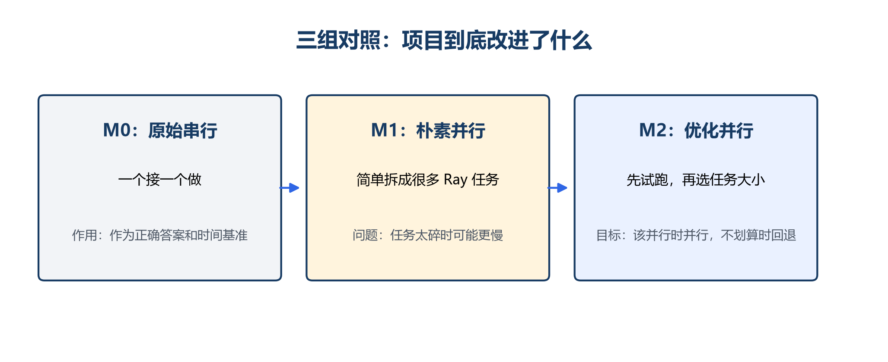
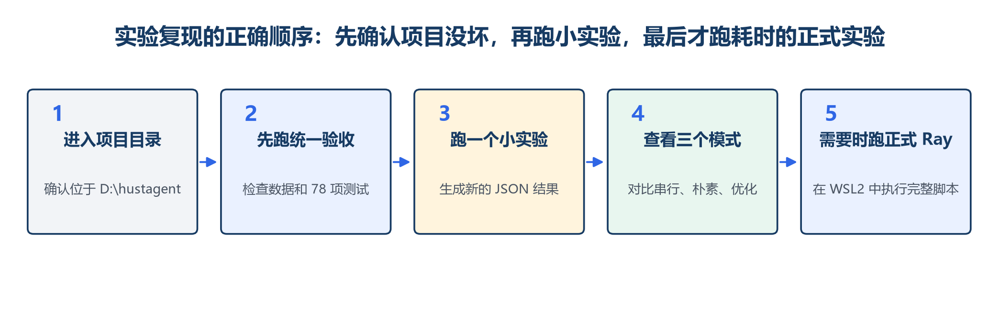

# 项目介绍与实验复现手册

## 本科生易懂版

项目：Python 代码自动并行化 Agent  
适用对象：第一次接触 Agent、Ray 和并行实验的本科生  
版本：v0.23.2  
日期：2026 年 8 月

> 这份手册的目标不是让你背代码，而是让你能够独立完成三件事：用自己的话讲清项目、亲手复现实验、回答老师最可能问的问题。

[PAGEBREAK]

## 零、先记住这一句话

> 这个项目让 Agent 把串行 Python 代码改成 Ray 并行代码，但不会盲目拆任务；它会先检查依赖、用小输入试跑、选择任务大小，并在结果错误或没有加速时回退。

如果你暂时看不懂其他内容，先把上面这句话理解透。

## 一、六个必须理解的词

| 词 | 大白话意思 | 你汇报时可以怎么说 |
|---|---|---|
| 串行 | 一个任务做完再做下一个 | M0 是正确答案和时间基准 |
| 并行 | 多个任务同时做 | 适合相互独立、计算较重的工作 |
| Agent | 会分析、调用工具、看结果、继续修改的程序 | 不是只问一次大模型 |
| Ray | 给 Python 分发任务的工具 | 先在单机多进程运行，以后可扩展到多机 |
| Worker | 实际执行任务的进程 | 类似真正干活的工人 |
| Chunk | 一次发给 Worker 的一包数据 | 太小开销大，太大又分不均 |

### 再理解两个指标

加速比：

```text
加速比 = 串行运行时间 ÷ 并行运行时间
```

- 大于 1：并行更快；
- 等于 1：差不多；
- 小于 1：并行更慢。

“第一次完整运行”和“预热后运行”：

- 第一次完整运行：包括启动 Ray 的时间；
- 预热后运行：Ray 已经启动，只看重复执行阶段。

这两个数字不能混在一起，因为 Ray 启动平均需要约 2.981 秒。

## 二、用一个生活例子理解项目

想象你要给 2000 份快递贴标签。

- M0：一个人从头贴到尾；
- M1：每一份快递都单独写一张派工单，交给多个工人；
- M2：先测一张派工单要花多久，再把几十或几百份快递打成一包，分给合适数量的工人。

如果贴标签本身只要一点点时间，M1 可能一直在写派工单，真正干活的时间反而很少。项目中的“任务提交、序列化和调度开销”就是写派工单和搬快递的成本。



## 三、项目从输入到结果怎样运行


### 第一步：读代码和检查依赖

系统用 Python 自带的 `ast` 把代码拆成结构。可以把 AST 理解成“把句子拆成主语、谓语和宾语”。系统会找：

- 哪些函数被调用；
- 循环里读了哪些变量、写了哪些变量；
- 下一次循环是否依赖上一次结果；
- 是否修改共享字典、列表或文件；
- 是否存在可以最后统一合并的求和、计数等操作。

例如：

```python
for i in range(1, n):
    output[i] = output[i - 1] + values[i]
```

第 `i` 次依赖第 `i-1` 次，因此不能简单同时运行。

### 第二步：Agent 给出方案

Agent 不直接只输出一份代码，而是先输出结构化计划：

```json
{
  "parallelizable": true,
  "pattern": "map_reduce",
  "worker_count": 4,
  "chunk_count": 8,
  "reason": "每个数据块独立，最后统一合并"
}
```

DeepSeek 主要帮助理解普通代码的含义和生成候选代码。依赖检查和性能选择仍由确定性程序完成。

### 第三步：小规模试跑

系统测量：

- 单项计算大约多久；
- 一次任务提交有多少固定开销；
- 输入和输出序列化需要多久；
- 不同任务的耗时差别是否很大；
- 当前机器有多少 CPU。

然后尝试少量 Worker 和 Chunk 组合，而不是一次把所有组合都跑完。

### 第四步：正式运行和回退

M0 先给出正确答案。M1/M2 必须与 M0 对比：

- 结果错误：丢弃候选；
- 结果正确但明显更慢：回到串行；
- 结果正确且更快：保存并行方案和数据。

## 四、项目目录怎么看

```text
D:\hustagent
├── benchmarks\             测试程序
├── configs\                实验参数
├── src\parallel_agent\     核心系统
├── scripts\                一键脚本
├── tests\                  自动测试
├── docs\data\              已冻结的正式实验数据
├── results\raw\            你新跑出的原始结果
├── generated\              Agent 生成代码与日志
└── work\                   临时构建和文档工具
```

### 你最需要认识的文件

| 文件 | 作用 | 汇报时是否需要打开 |
|---|---|---|
| `scripts/verify_project.py` | 一次检查项目数据和测试 | 建议现场运行 |
| `scripts/run_wsl_ray_formal.sh` | 跑完整 WSL2 Ray 实验 | 不建议现场跑，耗时较长 |
| `src/parallel_agent/analyzer.py` | 依赖检查 | 老师追问时可打开 |
| `src/parallel_agent/optimizer.py` | 是否并行和参数选择 | 老师追问核心方法时打开 |
| `src/parallel_agent/runner.py` | 重复运行并保存结果 | 解释实验公平性时打开 |
| `docs/data/` | 已冻结的正式证据 | 展示已有结果 |
| `results/raw/` | 新运行产生的结果 | 证明你亲手复现 |

## 五、正式实验是怎样设计的

### 三个模式

- `serial`：M0 原始串行；
- `naive`：M1 朴素并行；
- `optimized`：M2 优化并行。

### 八类任务

| 程序 | 中文理解 | 主要测试 |
|---|---|---|
| `large_payload` | 大数据传输 | 传输开销 |
| `load_imbalance` | 负载不均 | 慢任务拖尾 |
| `mandelbrot` | 分形图计算 | 规则计算密集 |
| `monte_carlo` | 随机模拟 | 独立计算与合并 |
| `pairwise_distance` | 两两距离 | 数据块划分 |
| `prime_count` | 素数统计 | CPU 密集 |
| `tiny_tasks` | 大量小任务 | 固定调度开销 |
| `word_count` | 词频统计 | 分块和归并 |

### 正式设置

- 3 轮独立实验；
- 每一轮每个模式先预热 1 次；
- 正式计时 5 次；
- 8 类任务 × 3 轮 × 3 模式 × 5 次 = 360 个正式计时；
- 所有候选都先通过正确性检查；
- M0、M1、M2 使用相同输入、随机种子和环境。


### 怎样读主结果

左图：

- 红色虚线是 1；
- 柱子高于红线，说明比串行快；
- M1 在大数据传输、两两距离和大量小任务上低于 1；
- M2 的 8 个柱子都在 1 以上。

右图：

- 纵轴是任务数量，而且使用对数坐标；
- 大量小任务中，M1 有 2000 个任务；
- M2 合并后平均约 9.3 个任务；
- 这解释了为什么 M2 的加速比从 0.255 提高到 3.087。


## 六、复现实验前的准备

### 你现在的环境

- 项目目录：`D:\hustagent`
- Windows 虚拟环境：`D:\hustagent\.venv`
- WSL2：本机已安装
- DeepSeek Key：本机 `.env` 已填写

> 不要把 `.env`、API Key 或完整终端环境变量截图发给老师，也不要提交到 Git。

### 复现分四个等级

建议严格按顺序：

1. 统一验收：确认项目和 78 项测试没有坏；
2. 依赖分析小演示：看系统能否拒绝错误并行；
3. 本地小实验：生成一份新的 M0/M1/M2 结果；
4. WSL2 正式 Ray 实验：需要时间时再跑。



[PAGEBREAK]

## 七、复现 A：先跑统一验收

### 操作

打开 PowerShell，执行：

```powershell
cd D:\hustagent
.\.venv\python.exe scripts\verify_project.py --run-tests
```

### 你应该看到什么

- 数据文件可以读取；
- 核心证据检查通过；
- 最后显示 78 项测试通过。

### 这一步说明什么

它说明当前代码、数据格式和自动测试是一致的。它不是正式性能实验，但正式汇报前必须先跑。

### 常见问题

如果提示找不到 `.venv`：

```powershell
cd D:\hustagent
python -m venv .venv
.\.venv\Scripts\python.exe -m pip install -e ".[dev]"
```

如果 PowerShell 阻止激活脚本，不需要激活，继续使用完整路径 `.\.venv\python.exe` 即可。

## 八、复现 B：做一个依赖分析演示

### 操作

```powershell
cd D:\hustagent
.\.venv\Scripts\parallel-agent.exe analyze benchmarks\prefix_sum\serial.py --output work\beginner-prefix-analysis.json
```

### 查看结果

```powershell
Get-Content work\beginner-prefix-analysis.json
```

### 你要找的字段

```json
{
  "parallelizable": false
}
```

同时会看到类似：

```text
indexed_loop_carried_dependency:output
```

大白话解释：当前循环写入的 `output[i]` 依赖前一次的 `output[i-1]`，不能直接把各次循环同时执行。

### 汇报时怎样说

> 这个例子证明系统不会看到循环就并行。依赖分析先把明显不安全的程序挡住，避免生成看起来能跑但结果错误的代码。

## 九、复现 C：跑一个本地小实验

### 操作

```powershell
cd D:\hustagent
.\.venv\Scripts\parallel-agent.exe benchmark benchmarks\prime_count\workload.py --size 8 --workers 4 --backend multiprocessing --modes serial naive optimized --repeats 2 --warmups 1 --output work\beginner-prime-result.json
```

### 查看结果

```powershell
Get-Content work\beginner-prime-result.json
```

### 重点看什么

- `correct`：结果是否正确；
- `median_seconds`：多次运行的中位耗时；
- `speedup`：相对串行的加速比；
- `selected_modes`：M2 是否选择并行，还是回退到串行；
- `task_count`：提交了多少个任务。

### 为什么你的秒数可能和文档不同

性能会受到 CPU、后台程序、温度、系统调度和输入规模影响。不要追求秒数完全相同。你应检查：

1. 三种模式是否都完成；
2. `correct` 是否为真；
3. 加速比方向是否能被任务数量和开销解释；
4. M2 是否在小输入时合理回退。

> 小输入下，M2 可能选择 `serial_fallback`。这不是失败，而是系统判断“现在并行不划算”。

## 十、复现 D：在 WSL2 跑完整 Ray 正式实验

### 第一次配置 WSL2 环境

在 PowerShell 输入：

```powershell
wsl
```

进入 Linux 后执行：

```bash
cd /mnt/d/hustagent
python3 -m venv ~/parallel-agent-env
source ~/parallel-agent-env/bin/activate
python -m pip install --upgrade pip
python -m pip install -e ".[dev]"
python scripts/verify_project.py --run-tests
```

### 以后每次进入 WSL2

```bash
cd /mnt/d/hustagent
source ~/parallel-agent-env/bin/activate
```

### 跑正式实验

```bash
bash scripts/run_wsl_ray_formal.sh results/raw/wsl_ray_my_reproduction
```

### 重要提醒

- 输出目录必须是一个新名字，脚本不会覆盖已有正式数据；
- 完整实验要运行多轮，不适合汇报现场执行；
- 运行时关闭大型游戏、训练任务和高负载软件；
- 不要在实验中途修改代码或输入；
- 如果需要停止，按 `Ctrl+C`，换一个新的输出目录重跑。

### 结果在哪里

```text
results/raw/wsl_ray_my_reproduction/
├── run_1/
├── run_2/
├── run_3/
└── summary/
    ├── ray_formal_aggregate.csv
    └── ray_formal_overall.json
```

### 怎样判断复现成功

- 8 类任务都有 M0、M1、M2；
- 三轮运行都存在；
- 正确性字段全部通过；
- 汇总 CSV 和 JSON 能正常打开；
- 具体秒数允许波动，但主要现象应能解释。

### 当前证据边界

这是真实 Ray 运行，但仍在一台物理机器的 WSL2 中。它验证单机多进程任务调度，不证明多机网络性能。

## 十一、复现 E：可选的 DeepSeek Agent 流程

这一步会调用 API，并产生 Token 成本。它不是复现主性能结论的必要条件。

```powershell
cd D:\hustagent
.\.venv\Scripts\parallel-agent.exe agent-loop examples\simple_serial_loop.py --entry run_serial --output-dir generated\simple_loop_demo --adapter deepseek --execution-backend multiprocessing
```

完成后重点看：

- Agent 生成的候选代码；
- 每一轮提示、报错和修复记录；
- 串行与并行输出是否一致；
- 模型调用次数和 Token；
- 性能选择是否仍由真实运行决定。

如果 API 报错：

1. 检查 `.env` 是否存在，但不要打印完整 Key；
2. 检查模型名和服务地址；
3. 检查网络；
4. 查看 `generated/simple_loop_demo` 中的日志；
5. 主实验可继续使用离线流程，不要让 API 问题阻塞整个汇报。

[PAGEBREAK]

## 十二、5 分钟现场演示脚本

### 第 1 分钟：讲问题

> 大模型把循环改成 Ray 很容易，但并行可能因为任务太碎、数据传输和启动成本反而更慢。我的项目重点是判断是否值得并行。

### 第 2 分钟：展示三组对照图

> M0 是串行基准，M1 是朴素并行，M2 会先测量再选参数，并在没有收益时回退。

### 第 3 分钟：跑统一验收

```powershell
.\.venv\python.exe scripts\verify_project.py --run-tests
```

指出 78 项测试通过。

### 第 4 分钟：跑依赖分析

```powershell
.\.venv\Scripts\parallel-agent.exe analyze benchmarks\prefix_sum\serial.py --output work\demo-analysis.json
```

指出 `parallelizable: false`。

### 第 5 分钟：展示正式结果图

重点说三个数字：

- M2 预热后平均加速 2.406 倍；
- M1 性能退化率 37.5%，M2 为 0%；
- 小任务从 2000 个合并到约 9.3 个，加速比从 0.255 提高到 3.087。

## 十三、老师可能问的问题与参考回答

### Q1：这个项目最核心的问题是什么？

核心不是“怎样把循环改成 Ray”，而是“怎样保证改完仍然正确，并且整体执行真的更快”。因此项目重点放在依赖、任务粒度、传输开销和回退。

### Q2：Agent 和普通调用一次大模型有什么区别？

普通调用只生成一次答案。这个 Agent 会先分析，再生成代码，真实运行，读取错误、正确性和时间，然后继续修复或换方案。

### Q3：你的创新点是什么？

把依赖检查、真实小规模试跑、自适应 Worker/Chunk、任务合并、正确性门控和性能回退组成一个闭环，并用 M0/M1/M2 证明这些机制减少了性能退化。

### Q4：为什么使用 Ray？

Ray 对 Python 友好，普通函数很容易变成并行任务；可以先在单机多进程验证，以后再扩展到多机。对于 20 天左右的本科生项目，它比 MPI 更容易形成完整闭环。

### Q5：什么代码适合并行？

每项工作相互独立、单项计算较重、数据传输不大、最后容易合并结果的代码。例如素数统计、分形图和随机模拟。

### Q6：什么代码不适合直接并行？

前一次循环结果被下一次使用、频繁修改共享状态、每项工作特别短、需要传输很大数据，或者只运行一次而启动成本很高的代码。

### Q7：为什么并行会更慢？

除了计算，还有启动 Ray、提交任务、序列化数据、进程通信和等待最慢 Worker 的成本。额外成本大于节省的计算时间时，就会变慢。

### Q8：Chunk 为什么不能越小越好？

Chunk 太小会产生太多任务，调度开销大；太大又会让任务数量太少或工作量不均。M2 通过试跑在两者之间找平衡。

### Q9：怎样保证正确性？

先运行 M0 得到黄金输出。M1/M2 的输出必须与它比较；整数精确比较，浮点数允许极小误差。错误结果不会被当作性能成功。

### Q10：怎样保证实验公平？

相同输入、随机种子、机器、软件版本和 Worker 上限；先预热再重复计时；运行顺序随机化；报告中位数；错误候选排除。

### Q11：为什么用中位数，不只用平均数？

一次性能实验可能被系统更新或后台任务拖慢。中位数不容易被某一次异常值带偏。平均数仍可作为补充，但不能单独使用。

### Q12：M2 为什么不保证所有任务都大幅加速？

有些任务本身没有足够并行收益。M2 允许回退，它的目标是“该并行时加速，不划算时少损失”，而不是强迫所有程序产生好看的数字。

### Q13：这是真正的分布式系统吗？

代码使用真实 Ray 任务和 Worker，但当前正式证据来自单台物理机器的 WSL2。它是可扩展到集群的单节点原型，还没有完成多机网络实验。

### Q14：DeepSeek 做了什么？

它帮助理解普通 Python 代码、给出并行计划、生成候选和修复错误。是否安全、是否更快，由静态检查和真实运行决定，不由模型自己打分。

### Q15：你用了 AI，自己的工作体现在哪里？

AI 可以帮助写代码和解释报错，但我需要理解并负责问题边界、三组对照、实验公平性、指标、失败案例、结果解释和局限。汇报时我不会把 AI 生成当成研究结论，结论来自真实证据。

### Q16：你最重要的一次错误判断是什么？

我最初认为任务拆得越多越快。`tiny_tasks` 的 2000 个任务只有 0.255 倍加速，实测固定任务开销后，我改成批处理，最终达到 3.087 倍。这让我理解了任务粒度的重要性。

### Q17：为什么区分冷启动和预热后运行？

Ray 第一次启动约 2.981 秒。如果只报告预热结果，会让一次性运行场景看起来过于乐观。分开报告才能说明适用场景。

### Q18：下一步最应该做什么？

先在两台真实机器上跑同一套实验，测网络传输和跨节点调度；再增加带共享状态、复杂依赖和普通 Python 循环的测试。

## 十四、你必须能亲口解释的四件事

汇报前，不看文档尝试回答：

1. M0、M1、M2 有什么区别？
2. 为什么 2000 个小任务会比约 9 个大任务更慢？
3. 为什么预热后是 2.406 倍，第一次完整运行却只有 0.044 倍？
4. 为什么当前结果不能说成多机实验？

如果这四个问题能自然回答，说明你已经掌握了项目的核心。

## 十五、汇报前 30 分钟检查表

- [ ] 在 `D:\hustagent` 运行统一验收，确认 78 项测试通过；
- [ ] 跑一次前缀和依赖分析，确认能找到 `parallelizable: false`；
- [ ] 打开中文三组对照图和主结果图；
- [ ] 准备好正式 CSV/JSON，不临时跑完整实验；
- [ ] 确认 `.env` 和 API Key 不会出现在屏幕或 Git；
- [ ] 记住 2.406、37.5%→0%、0.255→3.087 三组数字；
- [ ] 主动说明“真实 Ray、单台物理机器”；
- [ ] 准备一个失败案例和一个下一步计划；
- [ ] 关闭无关软件和通知；
- [ ] 把终端字号调大，命令提前放进记事本。

## 十六、最后的理解

这项研究不是在证明“AI 可以替人把所有代码自动变快”。它真正要证明的是：

> 大模型可以提供代码理解和改写能力，但是否安全、是否值得并行、应该怎样划分任务，必须由依赖分析和真实运行数据共同决定。

只要你能独立复现 A、B、C 三个步骤，能解释三组对照和两个失败案例，并如实说明单节点边界，就已经能够在汇报中体现一名本科生应有的科研能力：发现问题、设计比较、用数据验证、从失败中修改方法。

